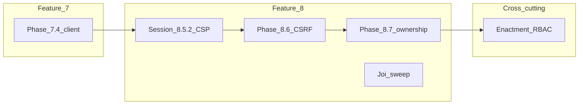

# Gap closure checklist (Features 0–8, excluding Feature 6)

**Purpose:** Track execution status for known gaps between the product plan and `client/` / `server/` / `shared/` until closed. **Feature 6** is excluded (separate audit).

**Roadmap of record:** [PROJECT_PLAN.md](PROJECT_PLAN.md) — this file is the **closure tracker**; update **Status** after each relevant tier-end or doc fix.

**Maintenance rules**

1. Set **Status** to `done` only when the deliverable is verified (smoke + lint where code changed).
2. Fill **Harness anchor** when a phase/session guide exists and you run tier commands against it.
3. Optional: link PR or commit in **Notes**.
4. New gaps from planning reviews: add a row with **Source** before closing the milestone.
5. Do not list Feature 6 work here.

---

## Dependency order (implementation)

**Note:** MLS credentials, production OAuth storage, calendar edit UI, and real-time sync are **tracked in Features 13 / 17** — they do not block the sequence above.

---

## Checklist

| ID | Area | Deliverable | Harness anchor | Primary code / docs | Status | Source | Notes |
|----|------|-------------|----------------|---------------------|--------|--------|-------|
| GC-00 | F0 | None required for gap closure per plan (core migration complete; UI polish deferred to F16). | — | — | done | PROJECT_PLAN Feature 0 | — |
| GC-01 | F1 | None — feature complete. | — | — | done | PROJECT_PLAN Feature 1 | — |
| GC-02 | F2 | Bright MLS live credentials + activation when vendor allows; E2E MLS path. | N/A ext | `server/src/services/brightMls/`, `propertyEnrichmentRoutes` | pending | PROJECT_PLAN F2 §2.3; delegated F13 | Blocked external |
| GC-02b | F2 | Production Google OAuth token storage + validation. | N/A ext | `server/src/config/googleOAuth.ts` | pending | PROJECT_PLAN F2 Key Files | Delegated F13 steps 6–8 |
| GC-03 | F3 | Calendar event create/edit UI (read-only today). | N/A F17 | — | pending | PROJECT_PLAN F3 Remaining; calendar-appointment-availability guide §objectives | Feature 17 |
| GC-03b | F3 | Real-time availability sync verification. | N/A F13 | — | pending | PROJECT_PLAN F3 Remaining | Feature 13 |
| GC-04 | F4 | None — complete. | — | — | done | PROJECT_PLAN Feature 4 | — |
| GC-05 | F5 | None — complete. | — | — | done | PROJECT_PLAN Feature 5 | — |
| GC-DOC-7 | F7 | Refresh **PROJECT_PLAN.md** Feature 7 body (stubs table, paths) to match `server/src/auth/` and current middleware. | doc | [PROJECT_PLAN.md](PROJECT_PLAN.md) | done | Second-pass vs code | Reconciled 2026-03-25 |
| GC-7.4 | F7 | Client auth: session cookie via `withCredentials`, Pinia auth store + composable, `/login` + magic-link verify UX, align logout. | phase 7.4 | `client/src/stores/authStore.ts`, `client/src/router/index.ts`, `client/src/composables/layout/useLogout.ts` | done | PROJECT_PLAN 7.4; [phase-7.4-guide.md](features/authentication/phases/phase-7.4-guide.md) | Tranche A |
| GC-7.5 | F7 | Password strategy (email + password production). | deferred | — | deferred | PROJECT_PLAN 7.5 | Post-beta |
| GC-7-E1 | F7 | Enactment: restrict admin/internal API per roles; expose `session/me` to client for gating. | [phase-7.4-guide.md](features/authentication/phases/phase-7.4-guide.md) session **7.4.4**; matrix: [INTERNAL_API_ENACTMENT_MATRIX.md](../server/docs/INTERNAL_API_ENACTMENT_MATRIX.md) | `server/src/routes/internal/**`, `authRouter.ts`, `client/src/router/index.ts` | done | PROJECT_PLAN Enactment | **7.4.4:** Matrix `server/docs/INTERNAL_API_ENACTMENT_MATRIX.md`; **`GET /appointments/list-for-admin-entry`** gated (`requireAuth` + `requireRole`, task **7.4.4.2**). Further per-route gates follow the matrix (not all routers). Lint verified on server change. |
| GC-7-E2 | F7 | Pre-alpha user-type switching for E2E (design + mechanism). | TBD | — | pending | PROJECT_PLAN F7 Open Questions | Design |
| GC-7-E3 | F7 | Google OAuth login (optional). | deferred | — | deferred | PROJECT_PLAN F7 Open Questions | Scope later |
| GC-7-E4 | F9/F15 | Wire session identity for guided alpha / beta feedback when those features start. | N/A F9+ | — | pending | PROJECT_PLAN F7 Enactment | Out of 0–8 closure |
| GC-DOC-8 | F8 | Refresh **PROJECT_PLAN.md** Feature 8 “Existing Infrastructure” table (CORS, rate limit, Joi, `.env.example`). | doc | [PROJECT_PLAN.md](PROJECT_PLAN.md) | done | Second-pass vs code | Reconciled 2026-03-25 |
| GC-8.5.2 | F8 | Helmet **Content-Security-Policy** tuned for API + Vue SPA; no violations in dev/prod builds. | [session-8.5.2-guide.md](features/security-hardening/sessions/session-8.5.2-guide.md) | `server/src/app.ts` | done | security-hardening | Baseline CSP; iterate `connect-src`/`img-src` in staging if needed |
| GC-8.6 | F8 | Replace `csrfProtection` stub with real CSRF (state-changing routes). | session 8.6.1 / [phase-8.6-guide.md](features/security-hardening/phases/phase-8.6-guide.md) | `server/src/middlewares/csrfTokens.ts`, `security.ts` | done | PROJECT_PLAN F8 step 6 | Client: `authStore` + `apiClientCore` |
| GC-8.7 | F8 | Replace `checkOwnership` stub with resource ownership checks. | session 8.7.1 / [phase-8.7-guide.md](features/security-hardening/phases/phase-8.7-guide.md) | `server/src/middlewares/ownershipChecks.ts` | done | PROJECT_PLAN F8 step 7 | Appointments first |
| GC-8-JOI | F8 | Joi (or equivalent) on remaining internal POST/PUT bodies missing `validateRequest`. | [session-8.5.4-guide.md](features/security-hardening/sessions/session-8.5.4-guide.md) | `server/src/routes/internal/**` | done | PROJECT_PLAN F8 step 5 | Batch A: session 8.5.3 (users + audit table). Batch B: session 8.5.4 (property mappings Joi). Batch C (session 8.5.5): verified `/v1/internal/auth` POSTs use `validateRequest`; relationship PATCH routers use inline Joi; dev router GET-only (N/A). Log: `session-8.5.5-log.md`. |
| GC-10-NOTE | Cross | `GIT_MCP_SERVER` / PAT hygiene in root `.env` (Feature 10 security note). | optional | `.env.example` | pending | PROJECT_PLAN Feature 10 Security Note | Optional hygiene |

**Excluded by policy:** Feature 6 (appointment workflow, org defaults, phases 6.x).

---

## Second-pass additions (summary)

Items **GC-DOC-7**, **GC-DOC-8** capture **stale PROJECT_PLAN** narrative vs implemented auth/CORS/rate limit/Joi. **GC-03** / **GC-03b** / **GC-02b** restate **delegated** plan rows so the checklist does not imply they are in-repo “done.” **GC-7-E2**, **GC-7-E4**, **GC-10-NOTE** come from **Open Questions** / **Enactment** / **Feature 10** security callouts on the second read.

---

_Last updated: 2026-03-25 (GC-7-E1: enactment matrix + list-for-admin-entry gate, session 7.4.4 tasks 7.4.4.1–7.4.4.2)_
