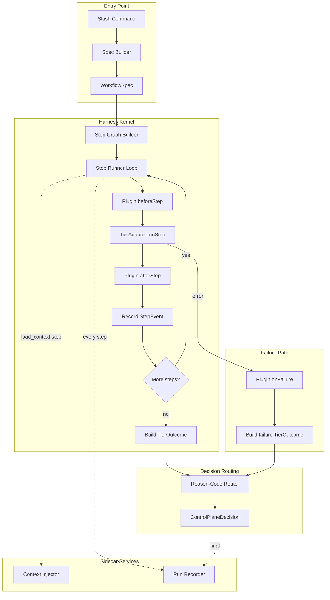

# Harness Charter

Version: 0.4 (TierUp-only + task two-phase)  
Status: Proposed end-state architecture  
Audience: AI-agent operators, workflow maintainers, toolchain contributors

---

## 1) Purpose

Define a first-class **workflow harness** that makes agent behavior:

- Deterministic enough to debug
- Flexible enough to adapt by policy/profile
- Efficient enough to reduce context load
- Clear enough that execution logic is not split between prose and code

This charter is **end-state design**, not migration instructions.

---

## 2) Why this exists

The current workflow manager already has strong capabilities:

- Tiered command model (`feature`, `phase`, `session`, `task`)
- Shared start/end orchestrators
- Rich outcome/control-plane routing
- Governance + audit integration

However, behavior is currently split across:

- TypeScript execution paths
- Large playbook/rule prose with behavioral directives

That split can produce ambiguity and context overhead.  
The harness solves this by establishing one executable control plane with typed policy hooks.

---

## 3) Scope and non-goals

### In scope

- Unified executable control model for workflow actions
- Typed contracts for run requests, routing, outcomes, and trace events
- Policy/plugin model for governance, audits, tests, docs, git, safety
- Explicit context budget and relevance-ranked injection
- Observable, replay-friendly run traces

### Out of scope

- Immediate refactor/migration sequencing
- UI redesign for IDE interaction surfaces
- Domain-level business logic changes in app/server code
- Replacing project documentation ecosystem itself

---

## 4) Current-state intent map (what we keep conceptually)

The harness must preserve the broad goals already represented in:

- `/.cursor/commands/tiers/START_END_PLAYBOOK_STRUCTURE.md`
- `/.cursor/commands/tiers/shared/tier-start-workflow.ts`
- `/.cursor/commands/tiers/shared/tier-end-workflow.ts`
- `/.cursor/commands/tiers/shared/control-plane-*.ts`
- `/.cursor/commands/utils/tier-outcome.ts`
- `/.cursor/commands/utils/command-execution-mode.ts`
- `/.cursor/commands/audit/run-start-audit-for-tier.ts`
- `/.cursor/commands/audit/run-end-audit-for-tier.ts`

### Intent categories to preserve

1. **Tier correctness**: strict ID semantics, parent/child relationships, cascading.
2. **State safety**: explicit plan vs execute separation.
3. **Outcome routing**: reason-code-driven control-plane behavior.
4. **Quality gates**: governance, audit, testing checks.
5. **Human collaboration**: predictable prompts and stop points.
6. **Documentation coherence**: guides/handoffs/logs remain synchronized.
7. **Generative planning**: tier-start planning **builds** the plan and tierDown steps from tierUp context; it does not **evaluate** existing tierDown docs. Goals → steps → assign to tierDown → discuss with operator.

### Task-start two-phase flow

Task-start uses a dedicated two-phase flow:

1. **Design phase**: The planning doc includes a **"Design Before Execute"** section with explicit coding goal, files to touch, pseudocode steps, implementation snippets (scaffold), and acceptance/test intent. Context and questions drive this; the task section from the session guide (tierUp) is the primary input.
2. **Execute phase**: The user confirms via the **"Begin Coding"** question key (`approve_execute_task`). The harness then re-invokes with the same spec and `mode: 'execute'`. No code runs until this confirmation.

Other tiers use a single approve step (`approve_execute`); only task has this explicit design-then-code separation.

---

## 5) Architectural principles

1. **Executable truth over prose truth**
   - Code returns structured facts and decisions.
   - Playbooks explain behavior; they do not define control flow.

2. **Deterministic core, pluggable policy**
   - Kernel owns sequence and contracts.
   - Plugins add behavior without changing kernel semantics.
   - Step graph is fully determined by `WorkflowSpec` before execution begins.

3. **Generative planning for tier-start**
   - Tier-start planning is generative: we build the plan and child (tierDown) steps from tierUp context, not by evaluating existing tierDown docs. That avoids circular or template-heavy downstream docs shaping the plan and keeps a single source of truth (tierUp) for what we are planning.

4. **Budgeted context by default**
   - All context injection has explicit caps and drop reporting.
   - Two-phase injection: plan what to load, then load it.

5. **Reason codes are stable API**
   - Small, versioned taxonomy.
   - Structural split: flow codes vs failure codes.
   - No ad hoc string proliferation.

6. **Every run is inspectable**
   - Step timing, transitions, failures, and final decisions are recorded.
   - Plugin diagnostics are first-class trace events.

7. **Start simple, add flexibility by need**
   - Ship with fixed step graphs per action, not dynamic DAGs.
   - Add plugin capabilities only as concrete use cases demand them.
   - Context scoring weights are static in v1; learned weights are a v2 concern.

8. **Control-plane runtime mandate (non-negotiable)**
   - The harness is a typed control-plane runtime, not a prose-driven workflow script.
   - If behavior cannot be expressed via contracts + reason-code routing + trace events, it must not be in production flow.
   - Runtime behavior comes from executable contracts; playbooks are explanatory only.

---

## 6) Reference model



### Data flow summary

1. Slash command -> `SpecBuilder` resolves profile defaults, tier config, and identifier.
2. Kernel builds step graph from spec.
3. For each step: plugins `beforeStep` -> adapter `runStep` -> plugins `afterStep` -> recorder.
4. Any step failure: plugins `onFailure` -> build failure outcome -> route.
5. All steps pass: build success outcome -> route.
6. Router maps `reasonCode` -> `ControlPlaneDecision`.
7. Decision returned to caller with trace.

### Failure handling path

- Step throws -> catch in kernel -> call `onFailure` on all plugins (wrapped in try/catch to prevent double-fault) -> build `TierOutcome` with failure reason code -> route to decision with `stop: true` -> record trace -> return.
- No silent swallowing. No fallthrough to next step on error. No implicit cascade.

---

## 7) Core contracts (v1)

### 7.1 `WorkflowSpec`

```ts
export type Tier = 'feature' | 'phase' | 'session' | 'task';
export type Action = 'start' | 'end' | 'reopen' | 'plan' | 'change' | 'validate' | 'checkpoint';
export type ExecutionMode = 'plan' | 'execute';
export type Profile = 'fast' | 'balanced' | 'strict' | 'debug';

export interface WorkflowSpec {
  specVersion: '1';
  runId: string;

  tier: Tier;
  action: Action;
  identifier: string; // canonical dotted ID for tier
  mode: ExecutionMode;
  profile: Profile;

  // Multi-pass tracking: context_gathering (1) -> plan_mode (2) -> execute (3)
  pass?: 1 | 2 | 3;

  featureContext: {
    featureId: string;
    featureName: string;
  };

  // Previous run summary for multi-pass continuity
  previousRunSummary?: {
    traceId: string;
    reasonCode: string;
    decisions: Record<string, string>;
  };

  policies: PolicySet;
  contextBudget: ContextBudgetConfig;
  constraints: ConstraintSet;

  // User-choice params set by caller when re-invoking after confirmation
  userChoices?: {
    continuePastVerification?: boolean;
    contextGatheringComplete?: boolean;
    pushConfirmed?: boolean;
    cascadeConfirmed?: boolean;
  };

  metadata?: {
    requestedBy?: string;
    sourceCommand?: string;
    note?: string;
    parentTraceId?: string; // cascade lineage
  };
}

export interface PolicySet {
  governance: 'off' | 'warn' | 'enforce';
  audits: 'off' | 'start_only' | 'end_only' | 'full';
  tests: 'skip' | 'changed_only' | 'full';
  docs: 'off' | 'minimal' | 'standard' | 'strict';
  git: 'off' | 'safe' | 'full';
  cascade: 'manual_confirm' | 'auto';  // v1 only supports manual_confirm; auto reserved for future
}

export interface ContextBudgetConfig {
  maxTokens: number;
  maxArtifacts: number;
  maxFiles: number;
  includeHistory: 'none' | 'recent' | 'full';
}

export interface ConstraintSet {
  dryRun: boolean;
  allowWrites: boolean;
  allowGit: boolean;
  allowNetwork: boolean;
}
```

**Design notes:**
- `featureContext` is required, not optional. Every run needs a feature anchor.
- `pass` makes the current implicit 3-pass model explicit (replaces ad-hoc `contextGatheringComplete` booleans).
- `previousRunSummary` carries forward decisions from prior passes without re-reading everything.
- `parentTraceId` enables cascade lineage tracking across tier boundaries.
- `includeRules` removed from contextBudget (governance rule inclusion is a policy concern, handled by the governance plugin's `appliesTo` check).

### 7.2 `HarnessKernel`

```ts
export type StepId =
  | 'validate_identifier'
  | 'preflight'
  | 'load_context'
  | 'gather_context'
  | 'plan_gate'
  | 'branch_ops'
  | 'doc_sync'
  | 'test_ops'
  | 'audit_ops'
  | 'scope_update'
  | 'cascade_eval'
  | 'finalize';

export type StepPhase = 'pre' | 'main' | 'post';

export interface StepDefinition {
  id: StepId;
  phase: StepPhase;
  requiredFor: Action[];       // which actions need this step
  requiresMode?: ExecutionMode; // skip in wrong mode
  dependsOn?: StepId[];        // explicit ordering
  canFail: boolean;            // if true, failure halts pipeline; if false, step is best-effort (failure does not abort)
  timeout?: number;            // ms, for observability
}

export interface HarnessKernel {
  getStepGraph(spec: WorkflowSpec): StepDefinition[];
  run(spec: WorkflowSpec, deps: HarnessDeps): Promise<HarnessRunResult>;
}

export interface HarnessDeps {
  contextInjector: ContextInjector;
  plugins: PolicyPlugin[];
  recorder: RunRecorder;
  adapter: TierAdapter;
  clock: () => number;
  profileDefaults: ProfileDefaultsResolver;
}

export interface ProfileDefaultsResolver {
  resolve(profile: Profile): { policies: PolicySet; contextBudget: ContextBudgetConfig };
}

export interface HarnessRunResult {
  success: boolean;
  output: string;
  outcome: TierOutcome;
  controlPlaneDecision: ControlPlaneDecision;
  traceId: string;
  stepPath: StepId[];  // ordered list of steps that ran
}
```

**Design notes:**
- `getStepGraph` makes the pipeline inspectable before execution. The agent or a debug tool can see the exact sequence for a given spec without running it.
- `StepDefinition` declares dependencies, mode requirements, and failure semantics up front.
- `ProfileDefaultsResolver` provides concrete numeric defaults for each profile.

### 7.3 `HarnessContext`

The context object passed through the pipeline must be explicitly shaped to prevent god-object drift.

```ts
export interface HarnessContext {
  spec: Readonly<WorkflowSpec>;
  traceHandle: RunTraceHandle;

  // Scoped, typed sub-contexts — not an open bag
  tierState: {
    scope: TierScopeSnapshot;
    status: string | null;
    branchName: string | null;
  };

  contextPack: ContextPack | null; // set by load_context step
  output: string[];                // accumulated output lines
  stepResults: Record<StepId, { success: boolean; output: string; durationMs: number }>;

  // Plugin-contributed diagnostics (append-only)
  diagnostics: Array<{ plugin: string; step: StepId; message: string }>;
}

export interface TierScopeSnapshot {
  feature?: { id: string; name: string };
  phase?: { id: string; name: string };
  session?: { id: string; name: string };
  task?: { id: string; name: string };
}
```

**Design note:** Sub-contexts are typed and scoped. New fields require explicit interface changes, preventing silent accumulation of `unknown`-typed bags like `auditPayload` and `params: unknown` in the current system.

### 7.4 `SpecBuilder`

The SpecBuilder is part of the entry point, not the kernel. It converts slash commands into `WorkflowSpec`. The kernel never parses slash commands.

```ts
export interface SpecBuilder {
  fromSlashCommand(
    command: string,
    args: Record<string, string | undefined>,
    options?: Partial<WorkflowSpec>
  ): Promise<WorkflowSpec>;
}
```

**Design note:** SpecBuilder must validate the produced spec before returning (e.g. `featureContext` present, `pass` valid for given flow). Invalid specs should fail fast with a clear error message.

### 7.5 `PolicyPlugins`

```ts
export type PluginCapability =
  | 'read_context'     // can read files/docs
  | 'write_context'    // can write files/docs
  | 'mutate_outcome'   // can modify outcome fields
  | 'block_step'       // can prevent a step from running
  | 'emit_diagnostic'; // can add warnings/info to trace

export interface PolicyPlugin {
  name: string;
  version: string;
  priority: number; // lower = runs first; explicit ordering

  capabilities: PluginCapability[];
  appliesTo(spec: WorkflowSpec): boolean;

  beforeStep?(ctx: HarnessContext, step: StepId): Promise<PluginStepResult>;
  afterStep?(ctx: HarnessContext, step: StepId): Promise<PluginStepResult>;
  onFailure?(ctx: HarnessContext, step: StepId, error: unknown): Promise<void>;

  contributeOutcome?(ctx: HarnessContext): Partial<TierOutcome>;
}

export interface PluginStepResult {
  action: 'continue' | 'skip_step' | 'abort_run';
  diagnostic?: string;
}
```

**Design notes:**
- `priority` provides explicit numeric ordering, eliminating nondeterministic plugin execution.
- `capabilities` declared up front so the kernel can enforce boundaries (a plugin without `write_context` cannot modify files).
- `PluginStepResult` is a typed return — plugins declare their intent instead of throwing or mutating context silently.
- `contributeDecision` removed. Plugins contribute to `outcome`; only the kernel maps outcome to decision. This prevents plugins from directly manipulating control-plane behavior.

### Plugin governance rules

- Maximum 8 registered plugins per harness instance.
- Each plugin must declare `capabilities` — kernel rejects undeclared operations.
- Plugins cannot import each other — communication is through `HarnessContext` only.
- Plugin naming: one plugin per concern (no "audit-and-governance" combo plugins).
- Plugins with `write_context` capability are only invoked when `constraints.allowWrites` is true.
- Plugins with `block_step` capability must return `PluginStepResult` with explicit `abort_run` reason.
- `onFailure` handlers cannot throw — kernel wraps all plugin calls in try/catch to prevent double-fault.

### Plugin registry contract

```ts
export interface PluginRegistry {
  register(plugin: PolicyPlugin): void;
  getForSpec(spec: WorkflowSpec): PolicyPlugin[];  // sorted by priority
  validate(): void;  // throws if > 8 plugins, or capability mismatch
}
```

### 7.6 `ContextInjector`

Two-phase injection: `plan()` is deterministic and inspectable; `build()` reads files and packs content.

```ts
export interface ContextSources {
  fs: FileSystemAdapter;       // read files
  git: GitStateAdapter;        // HEAD, branch, dirty list
  scope: TierScopeReader;      // .tier-scope content
  traceStore?: TraceStore;     // previous run traces for previousRunSummary
}

export interface ContextInjector {
  plan(spec: WorkflowSpec): ContextInjectionPlan;
  build(plan: ContextInjectionPlan, sources: ContextSources): Promise<ContextPack>;
}

export interface ContextInjectionPlan {
  requiredArtifacts: ArtifactRequest[];  // must-have (fails without)
  scoredCandidates: ArtifactRequest[];   // ranked by relevance
  budget: ContextBudgetConfig;
}

export interface ArtifactRequest {
  artifactId: string;
  path: string;
  kind: ContextArtifactKind;
  priority: 'required' | 'high' | 'medium' | 'low';
  estimatedTokens?: number;
}

export type ContextArtifactKind =
  | 'tier_guide'
  | 'tier_handoff'
  | 'tier_log'
  | 'governance_rule'
  | 'audit_baseline'
  | 'code_file'
  | 'previous_trace'
  | 'scope_state';

export interface ContextPack {
  summary: string;
  artifacts: ContextArtifact[];
  budget: {
    usedTokens: number;
    maxTokens: number;
    headroom: number; // remaining budget for agent working memory
    dropped: DroppedArtifact[];
  };
}

export interface ContextArtifact {
  artifactId: string;
  path: string;
  kind: ContextArtifactKind;
  relevanceScore: number; // 0..1
  freshnessScore: number; // 0..1
  snippet: string;
  tokenCost: number;
}

export interface DroppedArtifact {
  artifactId: string;
  path: string;
  reason: 'over_budget' | 'low_relevance' | 'stale' | 'duplicate' | 'excluded_by_policy';
  score: number;
  wouldHaveCost: number;
}
```

**Design note:** The plan/build split lets the agent (or a debug tool) see what the injector _would_ load before it loads anything. This directly answers "why was X not included?" without re-running.

### 7.7 `RunRecorder`

```ts
export interface RunRecorder {
  begin(spec: WorkflowSpec): Promise<RunTraceHandle>;
  step(handle: RunTraceHandle, evt: StepEvent): Promise<void>;
  decision(handle: RunTraceHandle, decision: ControlPlaneDecision): Promise<void>;
  contextReport(handle: RunTraceHandle, pack: ContextPack): Promise<void>;
  end(handle: RunTraceHandle, result: HarnessRunResult): Promise<void>;
}

export interface RunTraceHandle {
  traceId: string;
  runId: string;
  startedAt: string;
}

export interface StepEvent {
  step: StepId;
  phase: 'enter' | 'exit_success' | 'exit_failure' | 'skip';
  ts: string;
  durationMs?: number;
  reasonCode?: string;
  pluginDiagnostics?: string[];
  details?: Record<string, unknown>;
}
```

**Design notes:**
- `RunTraceHandle` avoids passing `traceId` loose everywhere.
- `decision()` and `contextReport()` are separate from `step()` — these are first-class trace events.
- `pluginDiagnostics` on step events shows what plugins said during each step.

---

## 8) Outcome and decision contracts

### 8.1 Tier outcome

```ts
export type TierStatus = 'completed' | 'needs_input' | 'blocked' | 'failed' | 'plan_preview';

export interface CascadeInfo {
  direction: 'down' | 'up' | 'across';
  tier: Tier;
  identifier: string;
  command: string; // canonical next command
}

export interface TierOutcome {
  status: TierStatus;
  reasonCode: ReasonCode;
  nextAction: string;       // single-sentence display hint, never an execution directive
  deliverables?: string;
  cascade?: CascadeInfo;
}
```

### 8.2 Control-plane decision

```ts
export interface ControlPlaneDecision {
  requiredMode: 'plan' | 'agent';
  stop: boolean;
  message: string; // user-facing
  questionKey?: QuestionKey;
  nextInvoke?: WorkflowSpec; // full spec for re-invoke, not loose params
  cascadeCommand?: string;    // e.g. "/task-start 6.4.4.1" — exact command string for cascade choice display in chat
}

export type QuestionKey =
  | 'approve_execute'
  | 'approve_execute_task'  // task tier only: "Begin Coding" after design artifact
  | 'context_gathering'
  | 'push_confirmation'
  | 'cascade_confirmation'
  | 'verification_options'
  | 'failure_options'
  | 'uncommitted_changes'
  | 'reopen_options';
```

**Design notes:**
- `nextInvoke` is a full `WorkflowSpec`, not loosely typed params.
- For **task** tier, when the outcome is `plan_mode`, the router uses `approve_execute_task` ("I approve this coding design and want to begin implementation") instead of `approve_execute`. Reason code stays `plan_mode`; only the question key varies by tier for UX. This eliminates the flat-option-key bugs the current playbook warns about.

### 8.3 Agent consumption contract

The agent (or any harness consumer) MUST:

1. **If `controlPlaneDecision.stop` and `controlPlaneDecision.questionKey`** — present the User choice required block in chat (or use AskQuestion with the specified question template); do not present the question as plain chat text.
2. **If `controlPlaneDecision.nextInvoke`** — on user approval, re-invoke the harness with that spec.
4. **Never cascade on failure** — when `success === false`, do not offer cascade or infer next steps.
5. **Never infer next step from output prose** — use `outcome.nextAction` only as a display hint; routing is driven by the decision matrix.

---

## 9) Reason-code taxonomy (v1)

### Structural split

Reason codes are split into flow codes and failure codes to prevent routing ambiguity.

```ts
export type FlowReasonCode =
  | 'context_gathering'
  | 'plan_mode'
  | 'start_ok'
  | 'end_ok'
  | 'task_complete'
  | 'pending_push'
  | 'verification_suggested'
  | 'reopen_ok'
  | 'uncommitted_blocking';

export type FailureReasonCode =
  | 'validation_failed'
  | 'audit_failed'
  | 'test_failed'
  | 'preflight_failed'
  | 'git_failed'
  | 'unhandled_error';

export type ReasonCode = FlowReasonCode | FailureReasonCode;
```

### Decision routing matrix

| reasonCode | stop | requiredMode | questionKey | nextInvoke behavior |
|---|---|---|---|---|
| `context_gathering` | true | plan | `context_gathering` | same spec with `pass: 2, mode: 'plan'` |
| `plan_mode` | true | plan | `approve_execute` (or `approve_execute_task` for task tier) | same spec with `pass: 3, mode: 'execute'` |
| `start_ok` | false | agent | none | cascade spec if present |
| `end_ok` | false | agent | none | cascade spec if present |
| `task_complete` | if cascade | plan if cascade | `cascade_confirmation` | cascade spec |
| `pending_push` | true | plan | `push_confirmation` | none (agent pushes then checks cascade) |
| `verification_suggested` | true | plan | `verification_options` | re-invoke with `continuePastVerification` |
| `reopen_ok` | true | plan | `reopen_options` | see reopen mapping below |
| `uncommitted_blocking` | true | plan | `uncommitted_changes` | same spec after commit/stash |
| `validation_failed` | true | plan | `failure_options` | none |
| `audit_failed` | true | plan | `failure_options` | none |
| `test_failed` | true | plan | `failure_options` | none |
| `preflight_failed` | true | plan | `failure_options` | none |
| `git_failed` | true | plan | `failure_options` | none |
| `unhandled_error` | true | plan | `failure_options` | none |

### `reopen_ok` nextInvoke mapping

| User choice | nextInvoke |
|-------------|------------|
| "Yes — I have a plan file" | `plan` action with `planContent` from user |
| "No — plan from scratch" | `plan` action without `planContent` |
| "No — quick fix" | none (user proceeds manually, then runs tier-end) |

### Tier-specific question keys

Reason codes remain tier-agnostic. The router may select a different **question key** by tier when the reason code is the same (e.g. `plan_mode` → `approve_execute` for feature/phase/session, `approve_execute_task` for task). This keeps routing uniform while allowing tier-appropriate UX (e.g. task "Begin Coding" vs generic "Yes — execute").

### Routing anti-patterns to avoid

- **Overloading `nextAction` with behavioral instructions.** `nextAction` is a single-sentence display hint, never an execution directive like "Push pending. Then cascade if present." The decision routing matrix handles all behavior.
- **Reason codes that require knowing the tier.** Routing should be uniform via `cascade` presence/absence, not tier-specific reason codes. Tier-specific *question keys* are allowed for presentation.
- **Free-form `string` for `reasonCode`.** The router must be exhaustive over the `ReasonCode` union type with no `default` fallthrough for known codes.

### Taxonomy governance rules

- Additions require explicit design review.
- Deprecations remain aliased for one compatibility window.
- Reason codes must be: concise, machine-stable, semantically unique.

---

## 10) Profile matrix

Profiles are operator-facing shortcuts that set policy defaults and context budgets.

| Profile | Goal | Governance | Audits | Tests | Docs | Git | Cascade | maxTokens | maxArtifacts | maxFiles |
|---|---|---|---|---|---|---|---|---|---|---|
| `fast` | Low-latency iteration | `warn` | `off` | `skip` | `minimal` | `safe` | `manual_confirm` | 4,000 | 8 | 5 |
| `balanced` | Day-to-day default | `warn` | `end_only` | `changed_only` | `standard` | `full` | `manual_confirm` | 8,000 | 15 | 10 |
| `strict` | High confidence gates | `enforce` | `full` | `full` | `strict` | `full` | `manual_confirm` | 12,000 | 25 | 20 |
| `debug` | Deep traceability | `warn` | `end_only` | `changed_only` | `standard` | `safe` | `manual_confirm` | 10,000 | 20 | 15 |

### Profile override rules

- Explicit `WorkflowSpec.policies` values override profile defaults.
- Explicit `WorkflowSpec.contextBudget` values override profile budget defaults.
- `constraints` always win over profile (safety first).
- `debug` enables verbose recorder events and expanded failure payloads.

---

## 11) Context injection model

### Goals

- Keep only what is relevant for current tier/action/mode.
- Avoid loading everything "just in case."
- Make dropped context visible to the operator.
- Two-phase: plan what to load, then load it.

### Tier context source policy (planning for \*-start)

For every **\*-start** planning path, context input is **tierUp-only**:

- **Planning** reads only from documents that belong to the current tier's parent(s) (tierUp). TierDown documents are **excluded** from planning context so they cannot drive or pollute the plan.
- **TierAcross/tierDown plan content is generated** from tierUp context (e.g. session intent from phase guide session entry, task list from session intent), not read from existing tierDown docs. Tier-start is a **generative** planning process: we build the plan and child steps from tierUp, not evaluate existing tierDown artifacts.
- **Concrete mapping:** Feature-start → feature guide only. Phase-start → feature guide (phase descriptor) + feature handoff. Session-start → phase guide (session entry) + phase handoff. Task-start → session guide (task section) + session handoff excerpt. Execute mode may subsequently read or write tierDown docs after the plan is approved.

Hooks may expose `getContextSourcePolicy()` returning `{ tierUpOnly: true, allowedSourceDescription }`; the planning doc and loaded-context section then record that policy for the agent.

### Candidate manifest (static, per tier+action)

For **\*-start** in plan mode, use only tierUp sources per the tier context source policy above. The table below also supports execute-mode and end flows where tierDown docs may be read.

| tier + action | Required candidates (plan: tierUp only) | High-signal candidates | Optional candidates |
|---|---|---|---|
| session + start | phase guide (session entry), tier-scope; phase handoff | — | audit baseline, governance rules |
| session + end | session guide, modified files list | test results, handoff | audit baseline, feature guide |
| task + start | session guide (task section), tier-scope; session handoff excerpt | — | governance rules for task files |
| task + end | session guide (task section), modified files | test results | audit baseline |
| phase + start | feature guide (phase descriptor), tier-scope; feature handoff | — | audit baseline |
| phase + end | phase guide, completed sessions list | test results | audit baseline, feature guide |
| feature + start | feature guide, PROJECT_PLAN entry, tier-scope | — | audit baseline |
| feature + end | feature guide, completed phases list | test results | audit baseline |

### Scoring formula

```
score = (tierAffinity * 0.35) + (actionAffinity * 0.25) + (freshness * 0.20) + (dependencyRelevance * 0.20)
```

Where:
- **tierAffinity** (0..1): 1.0 for exact tier match, 0.7 for parent tier, 0.3 for grandparent, 0.1 for unrelated.
- **actionAffinity** (0..1): 1.0 for exact action match (e.g. guide for start), 0.5 for complementary (e.g. handoff for start), 0.2 for tangential.
- **freshness** (0..1): based on file modification time relative to current session start. 1.0 if modified today, decays by 0.1 per day, floor 0.1.
- **dependencyRelevance** (0..1): 1.0 if artifact is referenced by another included artifact, 0.5 if referenced by spec, 0.0 otherwise.

### Budgeting algorithm

1. **Deduplicate** by path and kind. If the same file appears as multiple artifact kinds (e.g. `tier_guide` and `code_file`), keep the higher-affinity kind and drop the other. Add this before scoring.
2. Sort candidates by score descending.
3. Pack "required" candidates first (fail if they exceed budget).
4. Pack "high" candidates until 70% of remaining budget.
5. Pack "medium" candidates until 90% of remaining budget.
6. Reserve 10% headroom for agent working memory.
7. All remaining candidates -> dropped report with scores and reasons.

### Degradation under budget pressure

When budget is tight:
1. Summarize long artifacts instead of including full text.
2. Include only the relevant section of guides (e.g. task section from session guide, not the whole guide).
3. Drop audit baselines first (lowest action affinity for most runs).
4. Drop governance rules second (these are in `.mdc` rules already if needed).
5. Never drop tier-scope or the primary guide — these are required.

### Mode-specific injection preferences

- In `plan` mode, prefer: deliverables context, unresolved decisions, nearest-tier docs.
- In `execute` mode, prefer: exact files to change, test/audit constraints selected by policy, branch/scope state.

---

## 12) Observability and consistency targets

### Required trace fields (minimum)

- Full `WorkflowSpec` (input)
- `traceId`, `runId`, `specVersion`
- Repository state hash (git HEAD + dirty file list)
- Plugin versions active for this run
- Step graph as computed by `getStepGraph()`
- Each step: enter/exit/skip + duration + reasonCode + pluginDiagnostics
- Step graph checksum (e.g. hash of `stepPath.join('|')`) for replay validation
- Context injection plan + final pack (with drops)
- Final `TierOutcome`
- Final `ControlPlaneDecision`

### Replay equivalence criteria

Two runs are "replay equivalent" when:
1. Same step path (same steps executed in same order).
2. Same reason code.
3. Same `ControlPlaneDecision.questionKey` and `stop` value.
4. Equivalent `cascade` (same tier + direction).

Replay validation should verify the step graph checksum matches; a mismatch indicates the step graph diverged (e.g. different spec or plugin versions).

Note: `message` text and `deliverables` content may vary (they depend on doc content). Structural equivalence is the target, not text equality.

### Handling unavoidable nondeterminism

Sources of nondeterminism in this system:
- **File system state** (files may not exist yet) — capture in pre-run snapshot.
- **Git state** (branch may differ) — capture HEAD + branch name.
- **Clock** — injected via `deps.clock`, so replay can fix time.
- **Agent interpretation** — not in harness control, but trace makes divergence visible.

### Replay guarantee target

Given identical `WorkflowSpec` + repository state hash + policy/plugin versions, the harness should produce the same step path, same reason code, and equivalent control-plane decision.

### Non-functional targets (v1)

| Category | Target |
|---|---|
| Context budget compliance | 100% of runs honor max token cap |
| Step trace completeness | 100% of runs include begin/end + per-step events |
| Mean control-plane route time | < 25ms |
| Reason-code coverage | 95%+ runs use non-generic reason code |
| Unhandled error rate | < 2% of runs |
| Deterministic replay match | 90%+ for stable state replays |

---

## 13) Adapter boundary model

Tier adapters provide domain-specific mechanics only. They should be split into per-step handlers, not monolith switch statements.

```ts
export interface TierAdapter {
  validate(spec: WorkflowSpec, ctx: HarnessContext): Promise<void>;

  stepHandlers: Partial<Record<StepId, TierStepHandler>>;

  buildSuccessOutcome(spec: WorkflowSpec, ctx: HarnessContext): TierOutcome;
}

export interface TierStepHandler {
  run(spec: WorkflowSpec, ctx: HarnessContext): Promise<void>;
}
```

### Adapter constraints

- No mode-switch messaging.
- No direct "present choices" policy decisions beyond the playbook.
- No free-form reason-code invention.
- Side effects only within kernel-invoked step boundary.
- Adapter files should stay under 300 lines. If an adapter grows larger, extract step handlers into separate modules.

---

## 14) Playbook and rule role in end-state

### Rules become:

- concise constraints and quality doctrine
- references to canonical contracts
- operator guidance (human-readable)

### Rules are not:

- source of executable sequence
- fallback implementation scripts
- place to define hidden routing branches

---

## 15) Safety and failure behavior

### Failure handling contract

- Any failed step must produce: `reasonCode`, user-safe message, recommended next action.
- Failure always maps to a control-plane decision with `stop: true`.
- No implicit cascade on failure.

### Error recovery model

- **Retry**: not automatic. Kernel returns failure decision; operator chooses "Retry" from `failure_options`.
- **Rollback**: not in v1 scope. Partial completion is recorded in trace; manual recovery guided by trace.
- **Partial completion**: `stepResults` in `HarnessContext` records which steps succeeded before failure. The trace preserves this for diagnostic use.

### Plugin safety

- `onFailure` handlers are wrapped in try/catch by the kernel to prevent double-fault.
- If a plugin `beforeStep` returns `abort_run`, the kernel records the diagnostic and skips to outcome building.
- Plugins without `write_context` capability cannot modify files even if `constraints.allowWrites` is true.

### Safety priorities

1. Prevent destructive unintended side effects.
2. Preserve state visibility.
3. Stop and ask when uncertainty rises.

---

## 16) Compatibility envelope

Harness v1 should remain interoperable with:

- existing tier identifiers
- existing `controlPlaneDecision` consumption pattern
- existing `.tier-scope` lifecycle semantics
- existing command invocation style where feasible

Compatibility does not require preserving current internal file/module layout.

---

## 17) Quality rubric for harness design decisions

Evaluate major design changes against these questions:

1. Does this reduce ambiguity in execution behavior?
2. Does this reduce or bound required context load?
3. Does this improve run observability and replayability?
4. Does this preserve stable user-facing outcomes?
5. Can this be explained with one contract and one trace?

If answer is "no" for 2+ questions, redesign before adopting.

---

## 18) KPI framework

| # | Category | KPI | v1 Target | v2 Target |
|---|---|---|---|---|
| 1 | Efficiency | Mean context tokens per run | < 8,000 | < 5,000 |
| 2 | Efficiency | Context budget compliance rate | 100% | 100% |
| 3 | Efficiency | Mean kernel execution time | < 3s | < 2s |
| 4 | Efficiency | Dropped artifact visibility rate | 100% | 100% |
| 5 | Consistency | Reason-code coverage (non-generic) | 90% | 98% |
| 6 | Consistency | Replay structural equivalence rate | 85% | 95% |
| 7 | Consistency | Decision routing correctness (vs expected) | 95% | 99% |
| 8 | Debuggability | Step trace completeness | 100% | 100% |
| 9 | Debuggability | Mean time to identify failing step from trace | < 30s | < 10s |
| 10 | Debuggability | Plugin diagnostic coverage | 80% | 95% |
| 11 | Safety | Unhandled error rate | < 5% | < 1% |
| 12 | Safety | Write-without-permission rate | 0% | 0% |
| 13 | Safety | Cascade-on-failure rate | 0% | 0% |
| 14 | Trust | Runs requiring manual context re-supply | < 20% | < 5% |
| 15 | Trust | Playbook-vs-code behavioral divergence incidents | < 5/month | 0/month |

---

## 19) Risk register

| # | Failure mode | Severity | Likelihood | Detection signal | Mitigation |
|---|---|---|---|---|---|
| 1 | HarnessContext becomes god-object | High | High | Growing field count, `unknown` types | Strict typed sub-contexts per step phase (section 7.3) |
| 2 | Plugin ordering conflicts | High | Medium | Nondeterministic outcomes across runs | Explicit priority + capability declarations |
| 3 | Context budget set too tight, drops critical artifacts | High | Medium | Required artifact in dropped list | Separate required vs scored budgets (section 7.5) |
| 4 | Adapter re-creates monolith inside step handler | Medium | High | Adapter file exceeds 300 lines | Split adapter into per-step handler modules (section 13) |
| 5 | Reason-code proliferation | Medium | Medium | More than 20 codes in taxonomy | Require design review for additions |
| 6 | Profile defaults drift from actual usage | Medium | Medium | Operators always override profiles | Track override frequency, adjust defaults |
| 7 | Trace files grow unbounded | Low | High | Disk usage in trace directory | Rotation policy, max trace age |
| 8 | Replay test suite becomes brittle | Medium | Medium | Tests fail on doc content changes | Test structural equivalence, not text equality |
| 9 | Plugin `onFailure` throws, masking original error | High | Low | Double-fault in trace | Wrap all plugin calls in try/catch in kernel |
| 10 | Multi-pass re-invoke loses state between passes | High | Medium | Pass 2/3 re-reads everything | `previousRunSummary` on spec carries forward decisions |
| 11 | Cascade lineage lost across tier boundaries | Medium | Medium | No `parentTraceId` in cascade runs | Enforce `metadata.parentTraceId` on cascade specs |
| 12 | Migration breaks existing slash command UX | High | Medium | User reports command stopped working | Compatibility envelope + parallel-run validation |
| 13 | SpecBuilder produces invalid spec (missing featureContext, wrong pass) | High | Medium | Command fails with cryptic error | Validate spec before kernel.run(); fail fast with clear message |

---

## 20) Priority decisions

### Trade-off 1: Simplicity vs flexibility

**Decision: Start simple, add flexibility by need.**
- Ship with 4 profiles, not a fully generic policy configurator.
- Ship with a fixed step graph per action, not a dynamic DAG.
- Add plugin capabilities only as concrete use cases demand them.

### Trade-off 2: Determinism vs adaptability

**Decision: Determinism first.**
- The step graph is fully determined by `WorkflowSpec` before execution begins.
- Plugins can skip or annotate steps, but cannot reorder or inject new steps.
- Context scoring weights are static in v1. Learning from run outcomes is a v2 concern.

### Trade-off 3: Strictness vs speed

**Decision: Profile-driven, default to `balanced`.**
- `fast` profile exists for exactly the moments when strictness is wasteful.
- Never compromise trace completeness for speed — traces are cheap.
- Audit and governance are the heaviest policies; making them profile-controlled gives speed back without removing the capability.

### Final recommendation (explicit)

**Non-negotiable recommendation:** Treat this harness as a **typed control-plane runtime**.  
If behavior cannot be represented by typed contracts (`WorkflowSpec`, `TierOutcome`, `ControlPlaneDecision`), reason-code routing, and trace events, it does not belong in production execution.

**Practical operating rule:**
- **Executable contracts define behavior.**
- **Playbooks explain behavior.**
- **No hidden behavior in prose, ad-hoc scripts, or fallback narrative instructions.**

### Build priority order

1. **ContextInjector with two-phase plan/build** — highest immediate ROI; reduces context overload today.
2. **Declared step graph + StepEvent recording** — makes current behavior inspectable without changing it.
3. **Reason-code union type + exhaustive router** — eliminates the `string` ambiguity and `default` fallthrough.
4. **Profile defaults with numeric budgets** — gives immediate "fast mode" capability.
5. **Plugin interface with priority + capabilities** — only after the above are stable.
6. **Full kernel rewrite** — last, because the current orchestrators are functional; the above improvements can be layered on incrementally.

### SpecBuilder placement

**Decision:** SpecBuilder is part of the entry point, not the kernel. It converts slash commands into `WorkflowSpec`. The kernel never parses slash commands. SpecBuilder lives outside the kernel boundary.

---

## 21) Open design decisions (resolved and remaining)

### Resolved

1. **Profile selection**: explicitly provided every run (via spec), with sensible defaults per profile (section 10).
2. **Context scoring**: static-weighted in v1 (section 11). Learned weights deferred to v2.
3. **Plugin veto power**: plugins can skip or abort via `PluginStepResult`, but cannot reorder or inject steps (section 7.4).

### Remaining

1. Should run traces be persisted in repo-local docs, local DB, or both?
2. What is the maximum trace retention period before rotation?
3. Should the `SpecBuilder` auto-detect profile from tier/action, or require explicit selection?

---

## 22) Validation checkpoints (for iterative validation)

### Checkpoint A: Contract clarity

- Can a maintainer infer behavior from `WorkflowSpec` + reason-code table alone?

### Checkpoint B: Context fitness

- Does `ContextPack` show why each artifact was included?
- Are dropped artifacts explicit and understandable?

### Checkpoint C: Outcome consistency

- Do identical runs generate the same control-plane decisions?

### Checkpoint D: Debug comfort

- On failure, can we identify failing step + reason in under 30 seconds from trace?

---

## 23) Go/No-Go adoption gates

Before enabling this harness as the default runtime path, all gates must pass:

1. **Contract gate**
   - `WorkflowSpec`, `HarnessRunResult`, `TierOutcome`, and `ControlPlaneDecision` are implemented as strict typed contracts.
   - Router is exhaustive over `ReasonCode` union (no default fallthrough for known codes).

2. **Determinism gate**
   - `getStepGraph(spec)` is deterministic.
   - Step graph checksum is recorded and validated in replay.

3. **Context gate**
   - ContextInjector `plan()` + `build()` implemented.
   - Required artifact overflow fails explicitly.
   - Dropped artifact report emitted on every run where drops occur.

4. **Observability gate**
   - Trace includes spec, repo state hash, plugin versions, step events, decision event, and context report.
   - Failure path always records failing step and reason code.

5. **Safety gate**
   - No cascade on failure.
   - Plugin capability enforcement is active.
   - Write operations blocked when `allowWrites` is false.

6. **Behavior split gate**
   - No executable behavior is encoded only in prose playbooks.
   - Playbooks are explanatory and reference runtime contracts.

---

## 24) Charter success definition

**Success condition:** this operates as a typed control-plane runtime, not a prose-driven script.

The harness is successful when:

- operational behavior is predictable without reading large prose playbooks,
- context injection is bounded and explainable,
- outcomes are consistent across similar runs,
- debugging a failed workflow run is routine, not forensic,
- and behavior changes are introduced through contract updates and tests, not undocumented narrative guidance.
