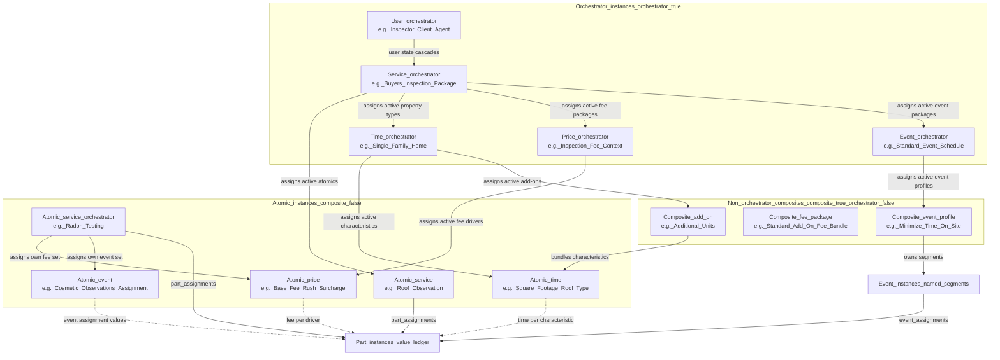

# Architecture principles

> **Status:** Locked canonical. Changes require deliberate architectural decisions.
> **Companion:** `DOMAIN_ARCHITECTURE_REDESIGN.md` (implementation plan — what to build, adapt, delete).

---

## 1. Domain model

The system has five block shape **types**. Each type owns one scheduling concern. The types are:


| Type      | Domain        | What it owns                                                                                                                                   |
| --------- | ------------- | ---------------------------------------------------------------------------------------------------------------------------------------------- |
| `user`    | **Identity**  | User identity and wizard state (inspector, client, agent). User block instance configurations drive cascades and user-based annotations via state. All user instances are orchestrators; none are currently composite; some are wizardVisible. |
| `service` | **Structure** | Which work items exist (part instances). Which downstream assignments are active for each service context. **Base** time/fee defaults and floors live only on **service orchestrator** part instances (§4.1); other service instances use the convergence UI without owning base. |
| `event`   | **Event**     | Part instance calendar segment assignments and time-axis patterns.                                                                             |
| `time`    | **Duration**  | Part instance duration details, driven by physical property characteristics.                                                                   |
| `price`   | **Fee**       | Part-instance fee contributions and orchestrator fee rollups, driven by configured fee rates, adjustments, and selected cascade assignments.                                                                                       |

All five types participate in the three-property instance model (§2). The current user configuration is `orchestrator=true, composite=false, wizardVisible=varies`, but these are configurations, not hard constraints — future use cases may change them.

**Domain separation rule:** Each domain writes to its own concern on part instances. Domains do not overwrite each other's values — they compose.

---

## 2. Three-property instance model

In addition to `id,` `entityKey,` `orderIndex,` `ref` values, and any other properties necessary to support domain operations, every block instance has three independent boolean properties:


| Property            | Axis         | Question it answers                                             |
| ------------------- | ------------ | --------------------------------------------------------------- |
| `**orchestrator`**  | Behavior     | Is this instance the root of an active assignment graph?        |
| `**composite`**     | Structure    | Does this instance own child block instances of the same shape? |
| `**wizardVisible**` | Presentation | Should this instance appear in the booking wizard?              |


**These are orthogonal axes.** Any combination is valid.

### 2.1 The composite × orchestrator grid

**Compositeness is always a relationship within the same block shape, and orchestration is always between different block shapes.** Any combination is valid.

|               | Orchestrator                                                                                                                                                                                 | Independent                                                                                              |
| ------------- | -------------------------------------------------------------------------------------------------------------------------------------------------------------------------------------------- | ------------------------------------------------------------------------------------------------------------- |
| **Composite** | "Buyer's Inspection" (service — assigns time, fee, event profiles), "Single-Family Home" (time — assigns property characteristics) | "Additional Units" (composite time add-on), "Standard add-on fee bundle" (composite pricing package), "Minimize Time On Site" (composite event profile — owns named segments) |
| **Atomic**    | "Radon Testing" (service — assigns its own fee drivers and event profiles), "Standard Event Schedule" (event — owns baseline segment assignments for default routing) | "Square Footage" (time), "Base Fee" (price), "Cosmetic Observations" (service), "Deck" (time add-on)           |


**As an example,** Buyer's Inspection is a composite service (made up of atomic services: roof observations, equipment observations, equipment testing, visible surface observations, infrared surface observations, etc.) and — as an orchestrator — it *assigns* which time instances (all property types except multifamily), fee instances (perUnit rates and discount values or percentages), and event instances (minimize time on site, no report, extra presentation time) are active. The shape-level validity graph defines the universe of options; the orchestrator picks from it.


### 2.2 wizardVisible examples

| Example                      | composite | orchestrator | wizardVisible | Why                                                     |
| ---------------------------- | --------- | ------------ | ------------- | ------------------------------------------------------- |
| "Buyer's Inspection Package" | ✓         | ✓            | ✓             | Top-level service the user picks                        |
| "Single-Family Home"         | ✓         | ✓            | ✓             | Top-level property type the user picks                  |
| {currently none}             | ✓         | ✓            | ✗             | Legitimate possibility with no current use-case         |
| "Additional Units"           | ✓         | ✗            | ✓             | Add-on visible in wizard, only valid under Multi-Family |
| "Minimize Time On Site"      | ✓         | ✗            | ✓             | Composite event profile (owns segments); not a cross-shape orchestrator |
| "Radon Testing"              | ✗         | ✓            | ✓             | Atomic service orchestrator; user picks it; assigns fee/event |
| "Standard Event Schedule"    | ✗         | ✓            | ✗             | Atomic event orchestrator; owns baseline segment assignments (default routing); not user-facing |
| "Inspector"                  | ✗         | ✓            | ✗             | Atomic user orchestrator (drives cross-shape cascade selections) |
| "Square Footage"             | ✗         | ✗            | ✓             | Property characteristic — MLS-populated and user-editable field       |
| {currently none}             | ✗         | ✗            | ✗             | Legitimate possibility with no current use-case         |

**The booking wizard shows only instances where `wizardVisible = true`, filtered by the validity graph of the selected orchestrators.**

---

## 3. Layering: shape → block instance → part instance

### 3.1 The hierarchy

```
Block Shape (template — defines type, domain, and valid shape-level relationships)
  └─ Block Instance (runtime — a concrete occurrence; carries orchestrator/composite/wizardVisible)
       └─ Part Instance (value ledger — accumulates domain values)
```

- **Shapes** define the template: the block type, the domain, and which shape-level relationships are structurally valid. (Shapes do not carry `orchestrator`, `composite`, or `wizardVisible` — those live on instances.)
- **Block instances** are the runtime occurrences. Each instance carries the three boolean properties (§2). An orchestrator instance sets active cross-shape cascade relationships. Service orchestrators are the only instances that establish base/default/minimum time and fee values. A composite instance owns child instances of the same shape. Every block instance creates part instances.
- **Part instances** are the value ledger. They belong to block instances across all block shapes (via `part_assignments`), including user block instances. Many fields may be null depending on the instance's domain role. The server returns these raw, versionable records; the booking client’s PartFinalizer resolves final time/fee/segment numbers (§4.3).

### 3.2 Orchestrator → atomic → part instance flow



**Diagram note:** Node labels are **distinct roles** (orchestrator vs composite package). Seed and migrations should not reuse the **same block instance name** for two different roles in the live graph — if a name appears twice, fix data or rename so admins can tell them apart. The diagram matches that convention.

**Reading the diagram:** Solid arrows (→) are cascade/ownership edges. Dashed arrows (-.→) are perUnit value-contribution edges — the block instance creates its own part instances with its domain's perUnit values filled (non-domain columns null). Service orchestrators set **base** values on their part instances (§4.1). The PartFinalizer (§4.3) resolves part-level values on the client, then groups time by event and fees by orchestrator for presentation. User orchestrators sit above the graph — they drive wizard state and cascades that determine which service orchestrators are active. Atomic orchestrators (e.g. Radon Testing) assign directly to fee and event without going through a composite service.


### 3.3 What each layer owns

**Orchestrator instances** own **active cross-shape assignments** — they select which downstream block instances of other types are **active for this orchestrator**, choosing from the universe of options the shape-level validity graph permits:

- User orchestrator: which service orchestrators are active for this user type; drives wizard state and user-based annotations
- Service orchestrator (composite): which atomic services, property types, fee packages, event packages are assigned to this service
- Service orchestrator (atomic, e.g. Radon Testing): which fee drivers and event profiles are assigned to this standalone service
- Time orchestrator: which property characteristics are assigned (e.g. "Single-Family Home" bundles sqft + foundation + roof + HVAC)
- Price orchestrator: which fee drivers are assigned in this pricing context
- Event orchestrator (e.g. "Standard Event Schedule"): which event profiles and baseline segment assignments are active
- Only **service orchestrators** set base/default/minimum time and fee values. All other orchestrators define active selections, not base values.

**Shape-level validity vs instance-level assignment:** The **shapes tab** defines which cross-shape relationships are structurally possible (the `valid_*` tables). Orchestrator editors **select from** that pre-built universe — they do not redefine it.

**Composite instances** own a **subtree of child instances of the same shape**. A composite may also be an orchestrator (e.g. "Buyer's Inspection" is composite service + orchestrator) or independent (e.g. "Additional Units" is a composite time add-on, "Minimize Time On Site" is a composite event profile that owns named segments).

**Atomic instances** each create their **own set of part instances** (via `part_assignments`). Values separate into two resolution tiers (§4.1):

- Atomic service (convergence point): part instances do **not** carry base values unless the block instance is also a service orchestrator. Atomic services are where the admin sees all downstream domain contributions inline via the PartFinalizer's aggregation.
- Atomic time: part instances carry **timePerUnit** — a duration contribution from one property characteristic. Base and fee columns are null.
- Atomic price: part instances carry **feePerUnit** — a fee contribution from one fee driver. Base and time columns are null.
- Atomic event: part instances participate in **event assignments** (relational, via `event_assignments` through-table) — which segment each part belongs to. Scalar time/fee columns are null.

The **PartFinalizer** (§4.3) resolves values at the **part-instance level** first, then rolls them up for presentation: time grouped by event, fees grouped by orchestrator.

---

## 4. Part instances as value ledger

Every block instance creates its **own set of part instances** (via `part_assignments`). Part instances are **per-block-instance records**, not a shared surface. This includes user block instances, even though their numeric value fields are null. The symmetry is intentional: it preserves versioning, cascade/state participation, and annotation attachment across all block types.

### 4.1 Two resolution tiers

Part instance values separate into two tiers based on who writes them:

| Tier | Who sets it | What it means | Part instance columns |
| --- | --- | --- | --- |
| **Base** (default + minimum) | Service orchestrator | The starting value and floor for time and fee. "Data Collection starts at 30 min / $100." | `baseTime`, `baseFee` |
| **PerUnit** (domain contribution) | Time, price atomics | A domain-specific contribution layered on top of the base. "Square Footage adds 12 min/1000 sqft." | `timePerUnit`, `feePerUnit` |

Only service orchestrator part instances carry base values. Only domain atomic part instances carry perUnit values. Non-domain columns are null. `Base` is the right name here because it captures both the **starting value** and the **floor**. If the system later needs to distinguish those concerns, `base` can split into separate `default` and `minimum` fields without changing the overall resolution model.

| Block instance type | `baseTime` | `baseFee` | `timePerUnit` | `feePerUnit` | Event assignment |
| --- | --- | --- | --- | --- | --- |
| Service orchestrator | ✓ (floor/default) | ✓ (floor/default) | null | null | via `event_assignments` (default) |
| Atomic service | null | null | null | null | — |
| Atomic time | null | null | ✓ | null | — |
| Atomic price | null | null | null | ✓ | — |
| Atomic event | null | null | null | null | via `event_assignments` (override) |
| User | null | null | null | null | — |

### 4.2 Event assignments are relational, not scalar

Time and price values are **quantitative** — numeric columns on part instances that the PartFinalizer sums. Event assignments are **relational** — which segment does this part belong to?

Event assignments live in the `event_assignments` through-table (event_instance ↔ part_instance), not as scalar columns on part instances:

| Tier | Who sets it | What it means |
| --- | --- | --- |
| **Baseline assignment** | Event orchestrator (e.g. "Standard Event Schedule") | "All parts default to the Primary segment" — rows in `event_assignments` linking baseline event-orchestrator part instances to the default event instance. |
| **Override assignment** | Event profile (e.g. "Minimize Time On Site") | "Reassign specific parts to EarlyArrival, OffSite" — rows in `event_assignments` linking event-profile part instances to specific segments. |

The PartFinalizer resolves event assignments **per part instance**: if the selected event profile has an explicit assignment for that part instance, use it; otherwise, fall back to the event orchestrator baseline.

### 4.2.1 Correlation across block-instance part rows (implementation contract)

Each block instance owns its own `part_instances`. The service orchestrator row for "Data Collection" and the time-atomic row for "Square Footage" are **different rows**. PartFinalizer must combine them so it never accidentally collapses distinct work items (e.g. two different atomic services that share a `part_shape`).

**Canonical approach — lineage (root relationship style):** Tie every contributing part instance to the **atomic service** (or appointment line item) it belongs to via the **same relationship graph** the wizard already uses (cascade / selection ancestry). Resolve time, fee, and event contributions **within that lineage bucket** only. This matches how validity is computed today and avoids inventing parallel keys.

**Rejected for now — `resolution_group_id` on `part_instances`:** A single column is too rigid when one row participates in multiple resolution stories; an array of group ids reintroduces join complexity and drift from the live cascade graph. Prefer lineage unless a future case proves otherwise.

**Still forbidden:** Implementing resolution by **`part_shape` alone** when multiple logical work items could collide.

### 4.3 PartFinalizer aggregation

Part instances are storage. The **PartFinalizer** (reactive pipeline in the booking wizard) is the aggregation layer. It reads all part instance sets, matches them at the part-instance level, and resolves:

```
resolvedTime  = base (from service) + sum(timePerUnit × input) across time atomics
resolvedFee   = base (from service) + sum(feePerUnit × input) across price atomics
resolvedEvent = event profile override ?? event orchestrator baseline assignment
```

The PartFinalizer enforces the base as a floor — resolved values cannot drop below the service orchestrator's base.

**Client vs server:** The server **does not** resolve time or fee totals. It serves **configuration and raw part-instance rows** (plus appointment-scoped inputs such as `property_details`). The **PartFinalizer on the client** applies user choices and produces resolved durations, fees, and segment placement for the live wizard. On **submit**, the client sends a **full appointment payload** (including resolved numbers the product needs to persist); the server stores it — it does not re-run the finalizer to “check” totals. If you later add read-only previews elsewhere, reuse the **same client-side** finalizer code paths (e.g. `@shared` pure helpers consumed only by the client bundle) rather than a second server-side calculator.

**Code shape (inside PartFinalizer):** Keep one pipeline name, split implementation into small units — e.g. `resolveTimeForPart`, `resolveFeeForPart`, `resolveEventForPart`, then `groupTimeByEvent`, `rollFeesByOrchestrator` — so the file does not become a single unmaintainable module.

### 4.4 Resolution order

The resolution pipeline should be read in this order:

1. **Create per-block-instance part records.**
Each block instance contributes its own raw, versionable part instances.

2. **Resolve part-level time.**
For each part instance, PartFinalizer starts with the service orchestrator's base and applies time atomic `timePerUnit` contributions using `property_details` inputs.

3. **Resolve part-level fee.**
For each part instance, PartFinalizer starts with the service orchestrator's base and applies price atomic `feePerUnit` contributions and percentage adjustments.

4. **Resolve part-level event assignment.**
For each part instance, PartFinalizer chooses `event profile override ?? event orchestrator baseline assignment`.

5. **Apply zero-out last (per part).**
After each part’s resolved time and fee — i.e. after `base + sum(perUnit × input)` (and percentage passes for fees) and **enforcing the service orchestrator floor** — if `zeroOutPart` (or equivalent) is set, **force that part’s resolved time and fee contributions to zero** (or exclude it from rollups). This is intentionally the **last** numeric step for the part — same spirit as doing addition after multiplication in PEMDAS (“… Aunt Sally, **Z**ach”): zero-out overrides the outcome of the prior steps, including floor.

6. **Group resolved time by event.**
Once each part instance has a resolved duration and segment, event-level totals are derived for slot layout and calendar placement.

7. **Roll resolved fees by orchestrator.**
Once each part instance has a resolved fee, fees are rolled up to the orchestrator block instance for presentation, quoting, or persistence.

This keeps the boundaries clean:

- **Storage** happens on part instances.
- **Resolution** happens in PartFinalizer on the client.
- **Presentation rollups** happen after resolution: time by event, fees by orchestrator.

### 4.5 Additive composition via PartFinalizer

The PartFinalizer sums perUnit contributions additively (or multiplicatively for percentage-based adjustments like discounts). No block instance overwrites another's contribution — each has its own records.

**Worked time example (same pattern as §4.3):** Base from service orchestrator part row + `timePerUnit × property_details` from each time-atomic row in the **same lineage bucket** (§4.2.1), then apply base floor, then apply zero-out if set (§4.4 step 5).

**Price (short):** Same as time: base + summed `feePerUnit` contributions (and percentage passes) per lineage bucket, then floor, then zero-out if set.

**Event (short):** Per part instance: `event_assignments` override from selected event profile else baseline from the event orchestrator.

### 4.6 Time atomics: rates vs inputs

Time atomics define **rates** (admin-configured). The **inputs** come from `property_details` (appointment-scoped data populated by MLS enrichment or booking wizard). The product is the **duration contribution**.

```
Rate (from time atomic config) × Input (from property_details) = Duration contribution
```

`property_details` stays as an appointment-scoped data surface — it describes the actual property being inspected. Time atomics read from it; they do not replace it or store input values.

### 4.7 Why per-block-instance records

This design provides three guarantees:

- **Provenance:** You always know which block instance contributed what — base values trace to the service orchestrator, perUnit values trace to specific domain atomics, and event assignments trace to either event-orchestrator baselines or event-profile overrides.
- **Clean undo:** Removing a block instance means deleting its part instances. No shared records to recalculate.
- **Versioned reconfiguration:** A reschedule after admin rate changes only affects the reconfigured block instance's part instances. The rest are untouched. The PartFinalizer recomputes from the current part instance set.

### 4.8 Zero-out / exclude part semantics

Flags such as `zeroOutPart` exclude a part from contributing to totals. **Ordering:** Apply zero-out **after** per-part resolution math and **after** the base floor (§4.4 step 5) — zero-out **wins** over floor for that part’s contribution to rollups. Whether the flag keeps its current name or becomes a first-class resolution state is an implementation detail; the invariant is **last-wins numeric override**.

**Admin:** Zeroed-out parts **still appear** in admin (e.g. service atomic editor / part grids). Exclusion applies to **booking resolution and rollups**, not to hiding configuration rows — admins must see and edit the flag.

---

## 5. Placement-slot model

Event shapes are **admin-managed placement types**. Each row defines a `placement_kind` and `anchor_edge` that the booking pipeline uses for time-axis layout.

### 5.1 Default placement types


| Event shape        | Placement kind | Anchor edge | Description                                |
| ------------------ | -------------- | ----------- | ------------------------------------------ |
| **Primary**        | `primary`      | —           | The main segment. Time-axis anchor.        |
| **FrontSecondary** | `secondary`    | `start`     | Anchored at the start of primary.          |
| **BackSecondary**  | `secondary`    | `end`       | Anchored at the end of primary.            |
| **FrontMarginal**  | `marginal`     | `start`     | Overlapping/abutting the front of primary. |
| **BackMarginal**   | `marginal`     | `end`       | Overlapping/abutting the back of primary.  |
| **FrontFloating**  | `floating`     | `start`     | Preferring before primary.                 |
| **BackFloating**   | `floating`     | `end`       | Preferring after primary.                  |


These are **defaults, not fixed**. Admins can add, rename, or remove placement types.

### 5.2 Event instances as named segments

Event instances are **named segments** owned by an event block instance (via `parent_block_instance_id`). The owning event block instance can be an orchestrator or a composite profile:

- The **event orchestrator** (e.g. "Standard Event Schedule", `orchestrator = true`) owns the **baseline** segment graph — the default assignment of all parts to the Primary segment. Service orchestrators reference this as their default event package.
- **Event profiles** (e.g. "Minimize Time On Site", `composite = true, orchestrator = false`) **override** parts of the baseline — reassigning specific parts to different segments. Profiles own their own named segments.

```
Event orchestrator (type='event', "Standard Event Schedule", orchestrator=true)
  └─ owns Event Instances (baseline segments):
       └─ "Primary"            → event_shape_ref = Primary
            └─ default event_assignments → all service parts

Event profile (type='event', "Minimize Time On Site", composite=true, orchestrator=false)
  └─ owns Event Instances (override segments):
       ├─ "EarlyArrival"       → event_shape_ref = FrontMarginal
       ├─ "Primary"            → event_shape_ref = Primary
       ├─ "FormalPresentation" → event_shape_ref = BackSecondary
       └─ "OffSite"            → event_shape_ref = BackFloating
            └─ each has event_assignments → overridden part instances
```

**Resolution:** PartFinalizer checks whether the selected event profile has an explicit assignment for each part instance. If yes, use the profile's segment; if no, fall back to the event orchestrator's baseline (typically Primary).

### 5.3 Event is data, not computation

The booking pipeline does **no placement calculation**. It reads the event assignment graph, groups part durations by event instance, and looks up each event instance's placement kind from its event shape ref.

Adding a new placement type requires only a new event shape row — no code changes to the layout engine.

### 5.4 Event instances are self-describing calendar segments

Each event instance carries everything needed to create a calendar event:

- Placement (from event shape ref: `placement_kind` + `anchor_edge`)
- Location (`location_type`, `location_place_id`, `location_address`, `location_lat/lng`)
- Attendees (via `event_instance_attendees` → user block instances)
- Calendar properties (`titleTemplate`, `descriptionTemplate`, `visibility`, `transparency`, invite links, reminders, etc.)

---

## 6. MLS enrichment architecture

`property_details` is an **appointment-scoped input surface**. Time atomics read from it; they do not replace it.

### 6.1 Three-table architecture


| Table                       | Role                                                                                                                                                                     |
| --------------------------- | ------------------------------------------------------------------------------------------------------------------------------------------------------------------------ |
| `property_details`          | Flat record of a property's physical characteristics (sqft, bedrooms, bathrooms, foundation, additional units, MLS number). Written by MLS enrichment, admin, or wizard. |
| `property_feature_mappings` | Auto-selection rules: MLS field match → select a time block instance.                                                                                                    |
| `property_field_mappings`   | Value population rules: MLS field → write to `property_details` column.                                                                                                  |


### 6.2 Data flow

```
MLS API → property_field_mappings → property_details (sqft, foundation, roof, etc.)
                                          ↓ (read by)
                                    Time atomics (duration = rate × input)
                                          ↓ (contribute to)
                                    Part instances (resolved total duration)

MLS API → property_feature_mappings → suggestedBlockInstanceIds
                                          ↓ (auto-select in wizard)
                                    Time block instances (composites + atomics)
```

### 6.3 Separation principle

- `property_details` = **what the property looks like** (appointment data)
- Time atomics = **how that translates to duration** (configuration data)
- These are different concerns. Merging them would mean the property summary depends on which time atomics are selected.

---

## 7. Admin architecture principles

### 7.1 Domain-specific editors replace EntityCard

The generic `EntityCard` + database-driven metadata pipeline is deprecated. Each entity type gets a **purpose-built editor** using Vuetify components directly. **Annotations are included** — there is no long-term exception that keeps admin field definitions in metadata tables.

**Why:** The domain has crystallized. Every entity type has known fields with known rendering needs. The metadata system was built for flexibility when the domain was undefined; that flexibility now creates indirection without benefit.

### 7.2 Two-mode admin

The admin has two modes:

- **Orchestration tab** — infrequent setup. Shows block instances where `orchestrator = true`. This includes both composite orchestrators (e.g. "Buyer's Inspection Package") and atomic orchestrators (e.g. "Radon Testing"). Each orchestrator editor presents **multi-select drop-downs** populated by the existing instances that the shape-level validity graph permits. The admin **selects** which downstream block instances are **active** for this orchestrator — it does not define what is structurally possible (that is the shapes tab's job).
- **Services tab** — day-to-day work hub. Shows atomic service instances. Each atomic service editor displays all part instances with inline time/price/event columns. The admin configures actual values in one place.

**Bottom-up workflow:** The admin always builds from the bottom up — (1) define validity on the shapes tab, (2) create atomics (services, times, fees, events) with part instances drawn from the shape-level graph, (3) open an orchestrator and **pick from what already exists**. This eliminates back-and-forth between tabs during day-to-day configuration.

### 7.3 Atomic service as convergence point

The atomic service editor is the **primary admin surface**. The admin opens e.g. "Roof Observations" and sees time, fee, and event **assignments for each part instance** in one view. Edits are **projected** onto the correct storage: perUnit columns on time/price atomic part rows, base on service-orchestrator part rows, and `event_assignments` for defaults/overrides — the UI is not a second source of truth.

---

## 8. Invariants

Rules stated as assertions. If any of these are violated, the architecture has drifted.

1. **Domain separation:** Each block type domain writes only its own concern to part instances. Domains compose; they do not overwrite.

2. **Three root blockInstance properties:** `composite`, `orchestrator`, and `wizardVisible` live on all block instances. All five block types participate — including user instances. Any combination of composite, orchestrator, and wizardVisible is valid. No combination implies another.

   2a. **Composite = same-shape children:** Compositeness is an inherently valid parent-child relationship within the same block shape. A composite instance owns child block instances of the same shape.

   2b. **Orchestrator = cross-shape active assignments:** An orchestrator instance **selects** which downstream block instances of other block shapes are **active for it**, choosing from the universe the shape-level validity graph permits (§3.3). Orchestration is independent of compositeness — an instance can be atomic and still orchestrate (e.g. a standalone service that assigns its own fee drivers and event profiles, or "Standard Event Schedule" as an atomic event orchestrator owning baseline segment assignments).

   2c. **WizardVisible = appearance in the booking wizard:** If cascades permit it, does this instance show up in the filtered lists for this block shape.

3. **Part instances are per-block-instance records with two resolution tiers:** Every block instance creates its own part instance set (via `part_assignments`), including user block instances. No block instance writes onto another's part instances.

   3a. **Base tier (service orchestrators only):** Part instances carry `baseTime` and `baseFee` — the default starting values and floor. Only service orchestrators set base values.

   3b. **Atomic services do not set base values unless they are also orchestrators.**

   3c. **PerUnit tier (domain atomics):** Part instances carry `timePerUnit` (time atomics) or `feePerUnit` (price atomics) — domain-specific contributions layered on top of the base. Non-domain columns are null.

   3d. **Correlation (lineage):** PartFinalizer must not resolve by `part_shape` alone when multiple logical work items could collide; bucket rows by **lineage to the atomic service / appointment line** per §4.2.1.

   3e. **Event assignments are relational:** Event assignments live in the `event_assignments` through-table, not as scalar columns. Event orchestrators set baseline assignments; event profiles set overrides. The PartFinalizer resolves per part instance: override wins if present, else baseline.

   3f. **PartFinalizer is the aggregation layer (client-only resolution):** Resolves `base + sum(perUnit × input)` for time/fee at the part-instance level within each lineage bucket, applies base floor, applies **zero-out last** (§4.8), then groups time by event and rolls fees by orchestrator. The server does not recompute these totals for booking — it persists the client-submitted appointment payload. Provenance is preserved — each contribution traces to a specific block instance's part instances.

   3g. **Why per-block-instance:** Clean undo (deleting a block instance = deleting its part instances), clear provenance (base vs perUnit is explicit in the schema), versioned reconfiguration safety (reschedule after admin changes only affects the reconfigured block instance's part instances).

4. **Events are data, not computation:** The booking pipeline reads event assignments and placement types from the database. It does not calculate placement from roles or rules.

   4a. **Event shapes are placement types, not profiles:** An event shape defines how a segment sits on the time axis (`placement_kind` + `anchor_edge`). It does not define which parts go where — that's the event assignment graph.

   4b. **Event instances are segments, not events:** An event instance is a named calendar segment owned by an event block instance. It carries placement, location, attendees, and all calendar properties.

   4c. **Placement types are extensible:** Adding a new event shape row with valid `placement_kind`/`anchor_edge` extends the layout engine. No code changes needed.

5. **property_details is appointment data, not configuration:** The `property_details` table describes the physical property being inspected. Time atomics define rates; property details provide inputs. These are separate concerns.

6. **User instances are orchestrators:** User block instances (inspector, client, agent) drive wizard state and user-based cascades. Their three-property values are configurations, not hard constraints.

---

*Extracted from DOMAIN_ARCHITECTURE_REDESIGN.md. This document is the source of truth for architectural rules. The companion implementation plan references these principles by section number.*