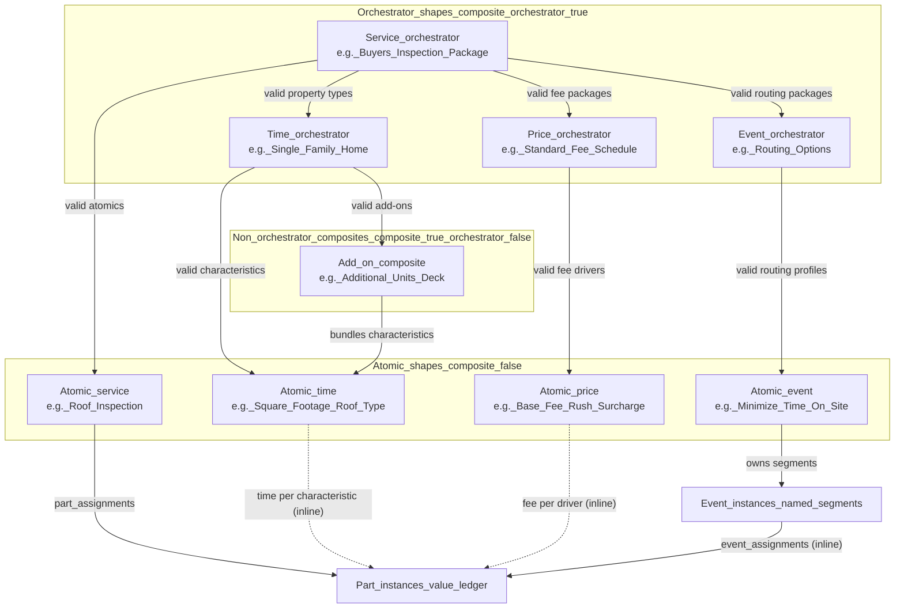

# Domain architecture redesign

> **Status:** Design draft — canonical reference while we decide what to build, rewrite, relocate, and delete.

---

## 1. The idea

The system has five block shape types. Each owns one scheduling concern. Part instances are the **ledger**: they accumulate defaults, minimums, and resolved values from the block instances that handle them. Block instances are **handlers**, not storage for final calculations.

Services split into two layers: a **composite orchestrator** that controls validity and floors, and **atomic** services that carry the actual part instance bags with real defaults. Downstream block types fill in domain-specific values.

### 1.1 Block type domain map

Every non-user block shape has three independent boolean properties (see §1.5 for details):

- **`composite`** — structural: contains child block instances
- **`orchestrator`** — behavioral: top-level entry point that controls the validity graph for its type
- **`wizardVisible`** — presentation: appears in the booking wizard for user selection

These are independent axes. A composite can be an orchestrator ("Buyer's Inspection Package") or a non-orchestrator add-on ("Additional Units"). An atomic can be wizard-visible ("Radon Testing") or invisible ("Square Footage").

| Type | Layer | Renamed? | Domain | Responsibility |
| --- | --- | --- | --- | --- |
| `service` | **composite** | No | **Orchestration** | Validity hub: which atomic services, which downstream time/price/event profiles are valid. Defaults and minimums. E.g. "Buyer's Inspection Package", "Commercial Inspection Package". |
| `service` | **atomic** | No | **Structure** | The part instance bag. Fills default/minimum values on parts for time, fee, and event. The **convergence point** where all domain values are visible inline. E.g. "Roof Inspection", "Exterior Inspection", "Interior Inspection". |
| `time` | **composite** | **Yes** (from `property`) | **Property type** | Bundles property characteristics into a property-type package. E.g. "Single-Family Home" (bundles foundation + sqft + HVAC + roof), "Condo/Co-op", "Multi-Family Home". Add-on composites like "Deck", "Additional Units". |
| `time` | **atomic** | **Yes** (from `property`) | **Property characteristic** | A single physical trait of the property that drives duration. Each contributes a time component to part instances. E.g. "Square Footage" (min/sqft), "Foundation" (crawl/slab/basement → duration modifier), "Roof Type" (flat/pitched/complex), "HVAC Equipment" (count/type), "Additional Client Time", "No Report", "Additional Reports". Reads input values from `property_details` (populated by MLS enrichment or wizard). MLS auto-selects time block instances via `property_feature_mappings` (see §7.8). Configured **inline** on the atomic service. |
| `price` | **composite** | **Yes** (from `coupon`) | **Fee package** | Bundles fee drivers into a pricing context. E.g. "Standard Fee Schedule", "Weekend/Rush Surcharge Package". Validity: which fee drivers apply. |
| `price` | **atomic** | **Yes** (from `coupon`) | **Fee driver** | A single fee component applied to part instances. E.g. "Base Inspection Fee" (flat per service), "Per-Unit Fee" (rate × sqft), "Rush Surcharge", "Discount". Each contributes a fee component. Configured **inline** on the atomic service. |
| `event` | **composite** | **Yes** (from `option`) | **Routing package** | Bundles routing profiles. E.g. "Routing Options" bundles "Standard" + "Minimize Time On Site". Validity: which profiles are available. |
| `event` | **atomic** | **Yes** (from `option`) | **Routing profile** | Segment manager: which parts feed which calendar segments, placement, attendees. E.g. "Standard" (all parts → Primary), "Minimize Time On Site" (split parts across segments). Configured **inline** on the atomic service. |
| `user` | _(neither)_ | No | **Identity** | Attendee identity. No part instance values. No composite/atomic distinction. |

### 1.2 What lives on part instances

Part instances become the **single value surface**. Block instances write into them; the booking pipeline reads from them.

| Concern | Current fields on part instances | Target additions/relocations |
| --- | --- | --- |
| **Time assignment** | `baseTime`, `rateOverBaseTime` | `defaultTime` (from `rateOverBaseTime`) = default/min from atomic service; `timePerUnit` = resolved by **time** block instance; `zeroOutTime` (former independent property)|
| **Price assignment** | `baseFee`, `rateOverBaseFee` | `defaultFee` (from `rateOverBaseFee`) = default/min from atomic service; `feePerUnit` = resolved by **price** block instance; `zeroOutFee` (former independent property) |
| **Event assignment** | _(none — today this is on event_assignments / differentialRole)_ | `defaultEvent` = default from atomic service; `eventOverride` = resolved by validated selections on **event** block instance |

### 1.3 Universal composite / atomic model

Every non-user block type follows the same two-layer pattern. **Composite** shapes (structural) own children; **orchestrator** shapes (behavioral) define the root validity graph. The **atomic service is the convergence point** where all domain values are visible and editable in one place. See §1.5 for the full three-property model.



**Orchestrator shapes (composite + orchestrator = true) own:**
- **Root validity graph:** which atomics of this type and downstream types are available
- Service orchestrator: which atomic services, which property types, fee packages, routing packages are valid
- Time orchestrator: which property characteristics apply to this property type (e.g. "Single-Family Home" bundles sqft + foundation + roof + HVAC)
- Price orchestrator: which fee drivers apply in this pricing context
- Event orchestrator: which routing profiles are available
- Defaults and minimums that flow down unless overridden at the atomic level

**Non-orchestrator composites (composite = true, orchestrator = false) own:**
- A subtree of children — but are **not** the root of a validity graph. They are nested packages (e.g. "Additional Units" under "Multi-Family Home") that bundle atomics without being top-level entry points.
- Appear on the Orchestration tab only as children of their parent orchestrator, not as standalone top-level nodes.

**Atomic service owns (the convergence point):**
- The actual `part_assignments` (part instance bag)
- Default and minimum values for its part instances
- **Inline view of all downstream domain values** for its parts: time per characteristic (from atomic time), fee per driver (from atomic price), event routing (from atomic event)
- The admin configures everything in one place — no tab-hopping

**Atomic time instances own:**
- A time component per part: duration contribution from one property characteristic (e.g. "Square Footage" contributes X min/1000 sqft to each applicable part)
- Multiple time atomics compose additively on a part instance

**Atomic price instances own:**
- A fee component per part: fee contribution from one fee driver (e.g. "Base Fee" = $200 flat, "Per-Unit Fee" = $0.08/sqft)
- Multiple price atomics compose additively on a part instance (discounts/surcharges as adjustments)

**Atomic event instances own:**
- The segment manager: named segments (event instances) with placement types and part assignments
- Configured inline on the atomic service editor

### 1.4 Placement-slot model (event shapes as placement types)

Event shapes are **not dropped**. They become **admin-managed placement types** — each row defines a placement kind and anchor edge that the booking pipeline uses for time-axis layout. The system ships with seven default rows, but admins can **add, rename, or remove** placement types as scheduling needs evolve:

| Default event shape | Placement kind | Anchor edge | Description |
| --- | --- | --- | --- |
| **Primary** | `primary` | — | The main segment. Time-axis anchor point. |
| **FrontSecondary** | `secondary` | `start` | Secondary segment anchored at the start of primary. |
| **BackSecondary** | `secondary` | `end` | Secondary segment anchored at the end of primary. |
| **FrontMarginal** | `marginal` | `start` | Marginal segment overlapping/abutting the front of primary. |
| **BackMarginal** | `marginal` | `end` | Marginal segment overlapping/abutting the back of primary. |
| **FrontFloating** | `floating` | `start` | Floating segment preferring before primary. |
| **BackFloating** | `floating` | `end` | Floating segment preferring after primary. |

These rows **materialize the `DifferentialPlacement` discriminated union** as database rows. No JSON placement column is needed on any table — the event shape **is** the placement. Because `placement_kind` and `anchor_edge` are structured columns on event shapes (§2.4), the pipeline is **parameterized by data**: adding a new placement type (e.g. a "BackMarginalFloating" hybrid) requires only a new event shape row with the right columns — no code changes to the layout engine as long as it handles the placement-kind/anchor-edge combination.

Event instances are **named segments** owned by an event block instance:

```
Event block instance (type='event', e.g. "Minimize Time On Site")
  └─ owns EventInstances (named segments):
       ├─ "EarlyArrival"       → event_shape_ref = FrontMarginal
       ├─ "Primary"            → event_shape_ref = Primary
       ├─ "ClientPresentation" → event_shape_ref = BackSecondary
       └─ "OffSite"            → event_shape_ref = FrontFloating
            └─ each has event_assignments → part instances
```

The booking pipeline does **no placement calculation** — it reads the event assignment graph, groups part durations by event instance, and looks up each event instance's placement kind from its event shape ref. Routing is data, not computation.

### 1.5 Three independent shape properties: composite, orchestrator, wizardVisible

Block shapes have three independent boolean properties that replace the legacy `composable`, `isStateControl`, and `canHaveParts` flags:

| Property | Meaning | Replaces |
| --- | --- | --- |
| **`composite`** | Structural: instances of this shape contain child block instances (validity graph, bundles) | `block_instances.composite` (moved to shape level) |
| **`orchestrator`** | Behavioral: this shape is the top-level entry point for its block type. Orchestrators define the root validity graph — which children, which downstream profiles are valid. Only orchestrators appear on the Orchestration tab. | `block_shapes.isStateControl` (partially) |
| **`wizardVisible`** | Presentation: instances of this shape appear in the booking wizard for user selection. Can be combined with either composite or atomic. | `block_instances.bookingMode` (simplified from ternary to boolean on shape) |

**Columns dropped:** `block_shapes.composable`, `block_shapes.isStateControl`, `block_shapes.canHaveParts`. These were flexibility scaffolding for early development. The three new properties express the same concepts more cleanly.

**The 2×2 grid — composite × orchestrator:**

| | Orchestrator (top-level validity root) | Non-orchestrator (nested / add-on) |
| --- | --- | --- |
| **Composite** | "Buyer's Inspection Package" (service), "Single-Family Home" (time), "Standard Fee Schedule" (price), "Routing Options" (event) | "Additional Units" (time add-on under Multi-Family — bundles sqft + HVAC + electrical), "Deck" (time add-on) |
| **Atomic** | _(rare — an orchestrator is usually composite)_ | "Square Footage" (time characteristic), "Roof Type", "Base Fee" (price driver), "Standard" (event routing profile), "Roof Inspection" (service) |

**wizardVisible is orthogonal:**

| Example | composite | orchestrator | wizardVisible | Why |
| --- | --- | --- | --- | --- |
| "Buyer's Inspection Package" | ✓ | ✓ | ✓ | Top-level service the user picks |
| "Single-Family Home" | ✓ | ✓ | ✓ | Top-level property type the user picks |
| "Additional Units" | ✓ | ✗ | ✓ | Add-on package visible in wizard, but only valid under Multi-Family |
| "Radon Testing" | ✗ | ✗ | ✓ | Atomic service add-on the user can directly select |
| "Square Footage" | ✗ | ✗ | ✗ | Property characteristic — never directly selected, always part of a property type package |
| "Minimize Time On Site" | ✗ | ✗ | ✓ | Atomic event routing profile the user can select as an option |
| "Routing Options" | ✓ | ✓ | ✗ | Orchestrator for event routing — admin-only, not shown in wizard |

**Key rules:**
- `orchestrator` implies `composite` (an orchestrator always has children). The reverse is not true — "Additional Units" is composite but not an orchestrator.
- `wizardVisible` is independent of both — any combination is valid.
- The admin Orchestration tab (§3.3) shows only blocks where `orchestrator = true`.
- The booking wizard shows only blocks where `wizardVisible = true`, filtered by the validity graph of the selected orchestrators.

---

## 2. Model changes (DB / Sequelize)

### 2.1 Rename block shape type enum

| Old | New | Migration |
| --- | --- | --- |
| `property` | `time` | `ALTER TYPE` + `UPDATE block_shapes SET type = 'time' WHERE type = 'property'` |
| `coupon` | `price` | `ALTER TYPE` + `UPDATE block_shapes SET type = 'price' WHERE type = 'coupon'` |
| `option` | `event` | `ALTER TYPE` + `UPDATE block_shapes SET type = 'event' WHERE type = 'option'` |

Touches: `block_shapes.type` enum, [server/src/db/models/admin/block_shape.ts](server/src/db/models/admin/block_shape.ts), [client/src/constants/blockShapeTypes.ts](client/src/constants/blockShapeTypes.ts), all code that switches on the old string values.

### 2.2 Tables that survive (repurposed, not dropped)

Event tables are **kept** and repurposed. The big structural deletion from the earlier draft is replaced by a **data migration**.

| Table | Current purpose | New purpose | Migration |
| --- | --- | --- | --- |
| `event_shapes` | Ad hoc shape per scheduling profile | **Admin-managed placement types** with structured `placement_kind` + `anchor_edge` columns | Migrate existing rows to set `placement_kind` and `anchor_edge`. Seed 7 default rows (Primary, FrontSecondary, BackSecondary, FrontMarginal, BackMarginal, FrontFloating, BackFloating). Keep full CRUD — admins can add, rename, or remove placement types. |
| `event_instances` | Named segments under event shapes | **Named segments owned by event block instances** | Add `parent_block_instance_id` FK → `block_instances.id` (the event block instance). Re-point `event_shape_ref` to one of the 7 canonical placement shapes. |
| `event_assignments` | Links event instances → part instances | **Unchanged conceptually** — routing edges from segments to parts | No structural change. Data migration: ensure all event assignments point at valid event instances under the new model. |
| `event_shape_attendees` | Invite/calendar config per event shape | **Renamed → `event_instance_attendees`** — attendees are per-segment, not per-placement-slot | Rename table. Replace `event_shape_id` FK with `event_instance_id` FK. Keep `user_type_block_instance_id` FK (references user block instances). Migrate existing attendee rows to reference event instances. See §7.7. |
| `valid_event_cascades` | Admin graph: which event shapes are valid for which block shapes | **Stays** — controls which event block shapes (type `event`) can cascade from which service shapes | Rename for clarity if desired; data stays the same. |
| `property_feature_mappings` | Maps MLS data source features → block instances (auto-selects block instances when MLS data matches) | **Re-scoped to time domain.** `block_instance_id` FK now targets **time block instances** — composites like "Single-Family Home" or atomics like "Deck". MLS enrichment auto-selects the right property type package and add-ons based on listing data. | Update existing rows: re-point `block_instance_id` values to time block instances after `property→time` rename. No structural schema change — FK already targets `block_instances`. |
| `property_field_mappings` | Maps MLS data source fields → `property_details` columns (populates sqft, bedrooms, foundation, etc.) | **Stays as-is.** Writes to the appointment-scoped `property_details` table. Time atomics read from `property_details` to derive duration contributions. | No schema change. |
| `property_details` | Flat property characteristics for a property version (sqft, bedrooms, bathrooms, foundation, additional units, MLS number) | **Stays as appointment-scoped input surface.** MLS enrichment and booking wizard write here; time atomics consume this data. See §7.8. | No schema change. |

### 2.3 Columns to drop

| Table.column | Why |
| --- | --- |
| `block_instances.differential_event_role_overrides` | Routing is now expressed by event instances pointing at placement-slot shapes — no JSON override blob needed |
| `block_instances.composite` | Moved to `block_shapes.composite` (shape-level, not instance-level). See §1.5. |
| `block_instances.bookingMode` | Replaced by `block_shapes.wizardVisible` (simplified from ternary `true/false/override` to boolean on shape). See §1.5. |
| `block_shapes.composable` | Replaced by `block_shapes.composite`. Legacy flexibility scaffolding. |
| `block_shapes.isStateControl` | Replaced by `block_shapes.orchestrator` + `block_shapes.wizardVisible`. See §1.5. |
| `block_shapes.canHaveParts` | Derivable: atomic service shapes can have parts. No longer an independent flag — the combination of `type = 'service'` + `composite = false` implies can-have-parts. |
| `event_shapes.differential_role` | Replaced by the structured `placement_kind` + `anchor_edge` columns. The shape **is** the placement type. |
| `event_shapes.include_reschedule_link` | Moves to event instances (per-segment, not per-placement-type). See §2.4. |
| `event_shapes.include_cancel_link` | Moves to event instances (per-segment, not per-placement-type). See §2.4. |

### 2.4 Columns / tables to add or adapt

| Item | Notes |
| --- | --- |
| **`block_shapes.composite`** (new boolean, default `false`) | `true` = instances of this shape are structural containers (own child block instances via validity graph). `false` = atomic. Moves from instance-level to shape-level — a shape is inherently composite or atomic, not per-instance. See §1.5. |
| **`block_shapes.orchestrator`** (new boolean, default `false`) | `true` = this shape is the top-level entry point for its block type. Orchestrators define root validity graphs. Implies `composite = true` (enforced). See §1.5. |
| **`block_shapes.wizardVisible`** (new boolean, default `false`) | `true` = instances appear in the booking wizard for user selection. Independent of composite/orchestrator. See §1.5. |
| **`event_instances.parent_block_instance_id`** (new FK) | Links each event instance (named segment) to the event block instance that owns it. This is the key structural addition — it ties segments to the routing profile. |
| **`event_shapes.placement_kind`** + **`event_shapes.anchor_edge`** (structured columns, required) | Defines the time-axis layout behavior for this placement type. `placement_kind` ∈ `{primary, secondary, marginal, floating}`, `anchor_edge` ∈ `{start, end, null}`. The pipeline reads these columns to decide how to position each segment — adding a new event shape with a valid `placement_kind`/`anchor_edge` combination extends the layout engine without code changes. |
| **`event_instances.location_type`** (new enum column) | `on_site \| off_site \| remote \| virtual`. Structured location semantics so the pipeline can make location-based decisions (drive time, overlap rules, constraint applicability) without parsing `locationTemplate`. Deprecates the `onSite` boolean that exists elsewhere. |
| **`event_instances.location_place_id`** (new nullable column) | Google Places `placeId` for the segment's location. Populated when `location_type = 'off_site'` and the admin picks a specific off-site location. Uses the same placeId infrastructure as `availability_settings.default_location_place_id` and the Places API integration on the Controls tab (`PlacesTimezonePanel`, `useDefaultLocation`). Nullable — on-site segments derive location from the appointment property; remote/virtual segments have no physical location. |
| **`event_instances.location_address`** (new nullable column) | Resolved address string for the placeId (same pattern as `availability_settings.default_location_address`). |
| **`event_instances.location_lat`** + **`location_lng`** (new nullable columns) | Coordinates for drive-time matrix integration when `location_type = 'off_site'`. Same pattern as `availability_settings.default_location_lat/lng`. |
| **`event_instances.include_reschedule_link`** (migrated from event_shapes) | Per-segment control: "Primary" might include reschedule/cancel links, "EarlyArrival" might not. |
| **`event_instances.include_cancel_link`** (migrated from event_shapes) | Same — per-segment. |
| **`event_instance_attendees`** (renamed from `event_shape_attendees`) | Through-table: `event_instance_id` FK → `event_instances.id`, `user_type_block_instance_id` FK → `block_instances.id` (user block instances). Each segment gets its own attendee list. FK targets user block instances — the attendee type is determined by which user block shape the block instance belongs to (inspector, client, agent, etc.). See §7.7. |

### 2.5 Entity key changes

[server/src/constants/entities.ts](server/src/constants/entities.ts) currently lists `eventShape` and `eventInstance` as global entity keys. These **stay** — event shapes and event instances remain first-class entities with their own CRUD.

However, their admin surface changes:
- **Event shapes** remain fully editable (create/rename/delete). They ship with 7 default rows but can be extended. The admin defines placement types; the pipeline reads `placement_kind` + `anchor_edge` from whatever shapes exist.
- **Event instances** are created/edited in the context of an event block instance, not standalone

---

## 3. Admin page redesign

### 3.1 Current structure (to change)

```
AdminPanel
├── Instances tab
│   ├── [per block shape] → BlockInstancesGroup
│   ├── Calibration tab → FeeCalibrationPanel
│   └── Events tab → EventInstancesSection
├── Shapes tab
│   ├── Block Shapes → ShapesTabBlockPanel
│   ├── Part Shapes → ShapesTabPartPanel
│   ├── Annotation Shapes → ShapesTabAnnotationPanel
│   └── Event Shapes → ShapesTabEventPanel
├── Appointments tab → DataManagementTab
└── Controls tab → BusinessControlsTab
```

### 3.2 What to remove or adapt in admin

| Current artifact | Action | Why |
| --- | --- | --- |
| **Calibration tab** (`FeeCalibrationPanel`, `useCalibrationChart`) | **Remove** | Fee calibration becomes a concern of **price** block instances editing part fee values directly; a chart is nice-to-have but not structural |
| **Events tab** on Instances (`EventInstancesSection` and children) | **Relocate** — move into the event block instance editor as an inline segment manager | Event instances are no longer standalone; they live under the event block instance that owns them. The existing components can be adapted to work in that context. |
| **Event Shapes sub-tab** on Shapes (`ShapesTabEventPanel`) | **Adapt** | Event shapes are now placement types with `placement_kind` + `anchor_edge`. The sub-tab becomes a placement-type editor: admin can create, rename, reorder, or remove placement types. Simpler than today (fewer fields: name, placement_kind dropdown, anchor_edge dropdown, active toggle). |
| **Metadata system + EntityCard** | **Deprecate** — replace with domain-specific editors using Vuetify directly | The domain has crystallized; every entity type has known fields. The 160-file EntityCard + metadata pipeline is indirection without flexibility benefit. Keep metadata only for annotations. See §3.4 for full decision, §6.8 for deletion inventory. |
| **Differential role matrix** on block instance forms | **Remove** | Replaced by event instance → placement-slot shape assignment on event block instances |

### 3.3 Target admin structure

The admin has two modes: **orchestration setup** (infrequent — defining what's valid) and **atomic service configuration** (day-to-day — setting actual values). The atomic service is the convergence point where all domain values are visible and editable inline.

```
AdminPanel
├── Orchestration tab (orchestrator shapes only — infrequent setup)
│   ├── Service packages (orchestrator=true services)
│   │   └── [e.g. "Buyer's Inspection Package"] → validity editor:
│   │       ├── Which atomic services: Roof, Exterior, Interior, ...
│   │       ├── Which property types (time): Single-Family, Condo, ...
│   │       ├── Which fee packages (price): Standard Fees, Rush Surcharge, ...
│   │       └── Which routing packages (event): Standard, Minimize Time, ...
│   ├── Property types (orchestrator=true time)
│   │   └── [e.g. "Single-Family Home"] → which characteristics apply:
│   │       Square Footage ✓, Foundation ✓, Roof Type ✓, HVAC ✓
│   ├── Fee packages (orchestrator=true price)
│   │   └── [e.g. "Standard Fee Schedule"] → which fee drivers apply
│   └── Routing packages (orchestrator=true event)
│       └── [e.g. "Routing Options"] → which routing profiles apply
│
├── Services tab (atomic layer — the work hub)
│   └── [per atomic service shape] → atomic service editor:
│       ├── Part instances (the work items)
│       └── Per part instance, inline domain columns:
│           ├── Time:  per characteristic (sqft: 12 min/1000, roof: +15 min complex)
│           ├── Fee:   per driver (base: $200, per-unit: $0.08/sqft)
│           └── Event: segment assignment (→ Early Arrival / Primary / OffSite)
│       (Admin sees and edits all three domains without leaving this view)
│
├── Shapes tab (structural — name, type, ordering)
│   ├── Block Shapes (name, type, composite / orchestrator / wizardVisible, ordering)
│   ├── Part Shapes (name, ordering)
│   ├── Annotation Shapes (name, content schema)
│   └── Event Shapes (placement-type editor: name, placement_kind, anchor_edge)
├── Appointments tab → DataManagementTab (unchanged)
└── Controls tab → BusinessControlsTab (constraints, calendar, availability)
```

**Key UX changes:**

- **The atomic service editor is the primary admin surface.** The admin opens "Roof Inspection" and sees every part instance with its time rate, fee rate, and event segment assignment in one view. All three downstream domains converge here — no tab-hopping to time/price/event block editors.
- **Orchestration is a separate, infrequent concern.** Orchestrator shapes (where `orchestrator = true`) define "what's available" — which atomics, which profiles, which cascades. This is setup work, done once per service package, not touched daily. Non-orchestrator composites like "Additional Units" or "Deck" are add-on packages nested under orchestrators.
- **Domain values are edited inline on the atomic service**, but they are still **stored on** their respective domain block instances (time, price, event). The inline editor is a projection — when the admin changes a time rate on a part, the write goes to the atomic time block instance. This preserves the clean data model while eliminating the UX friction.
- **The segment manager (§3.5) lives inside the event column** of the atomic service editor. When the admin clicks an event assignment, it expands to the segment manager for that event profile.
- **Shapes tab stays purely structural** — event shapes are a placement-type editor. No validation logic on shapes.

### 3.5 Segment manager UX (event block instance editor)

The segment manager is the primary admin interface for event routing. It replaces the old Events tab, the differential role matrix, and the event instance standalone editor. The core principle: **the admin assigns concrete part instances to named segments with known placement slots**.

By the time an event block instance is being configured, all atomic services and their part instances exist. The admin sees the full inventory and assigns each part instance to exactly one segment.

**Layout:**

```
┌─────────────────────────────────────────────────────────────────────────┐
│ Event: "Minimize Time On Site"                                         │
├───────────────────────────┬─────────────────────────────────────────────┤
│ AVAILABLE PART INSTANCES  │ SEGMENTS                                    │
│ (grouped by atomic svc)   │                                             │
│                           │ ┌─ Early Arrival [FrontMarginal ▾] ───────┐ │
│ ▼ Roof Inspection         │ │  Roof Inspection → Data Collection      │ │
│   ☐ Data Collection       │ │  Exterior Inspection → Data Collection  │ │
│   ☐ Report Writing        │ └─────────────────────────────────────────┘ │
│                           │                                             │
│ ▼ Exterior Inspection     │ ┌─ Primary [Primary ▾] ──────────────────┐ │
│   ☐ Data Collection       │ │  Interior Inspection → Data Collection │ │
│   ☐ Report Writing        │ └─────────────────────────────────────────┘ │
│                           │                                             │
│ ▼ Interior Inspection     │ ┌─ Client Presentation [BackSecondary ▾] ┐ │
│   ☐ Data Collection       │ │  Interior Insp → Formal Presentation   │ │
│   ☐ Report Writing        │ └─────────────────────────────────────────┘ │
│   ☐ Formal Presentation   │                                             │
│                           │ ┌─ OffSite [FrontFloating ▾] ────────────┐ │
│ ⚠ 0 unassigned            │ │  Roof Inspection → Report Writing      │ │
│                           │ │  Exterior Inspection → Report Writing   │ │
│                           │ │  Interior Inspection → Report Writing   │ │
│                           │ └─────────────────────────────────────────┘ │
│                           │                                             │
│                           │ [+ Add Segment]                             │
└───────────────────────────┴─────────────────────────────────────────────┘
```

**Behavior:**

- **Left panel** shows all part instances from valid atomic services, grouped by their source block instance. Each part instance displays its name and (if time rates are set) its duration. A part instance that has been assigned to a segment shows a checkmark or is grayed out.
- **Right panel** shows named segments (event instances). Each segment has a **placement-type dropdown** (populated from event shapes) and a list of assigned part instances (event_assignments).
- **Assignment** is drag-and-drop or checkbox-select from left to right. Each part instance can belong to exactly one segment.
- **Completeness indicator** at the bottom of the left panel: "⚠ N unassigned" warns the admin when part instances haven't been routed. The UI can enforce that all parts are assigned before saving — an unrouted part instance would have no segment and no calendar placement.
- **Default case:** The "Standard" event block instance has one segment ("Inspection", placement = Primary) with all part instances assigned. The admin sees the full list on the right in one group.

**Why this works:** The natural granularity of atomic services gives you routing granularity for free. "Roof Inspection → Data Collection" and "Interior Inspection → Data Collection" are **already distinct part instances** on distinct block instances — the admin doesn't need to pre-split part shapes to route subsets. The segment manager just assigns existing part instances to segments.

### 3.4 EntityCard and metadata system deprecation — DECIDED

**Decision:** Replace the generic `EntityCard` + database-driven metadata pipeline with **domain-specific editors** that use Vuetify components directly. Keep metadata only for annotations.

**Why now:** The metadata system was the right call when the domain was undefined. You didn't know what fields a "property" block shape would need vs a "coupon" block shape — making it database-configurable let you iterate without code changes. Now the domain has crystallized: every entity type has known fields with known rendering needs. The flexibility is no longer earning its keep; it's just indirection.

**What the metadata system currently does (and why it's overkill):**

The system stores per-field rendering configuration in 3 DB tables (`AdminMetadata`, `AdminPrimitiveMetadata`, `AdminRelationshipMetadata` + select option children) with **125 seed rows**. Each row specifies:
- `visibility` — titleRow, expandedDirect, expandedPanel, hidden, notConfigured
- `layout` — inline or stacked
- `renderAs` — text, number, select, multiselect, statusButton, iconSelect, relationshipCollection
- `panel` — none, parts, relationships, annotations, events, composition
- `displayOrder`, `label`, `isRequired`, `bulkEdit`, `statusButtonColor`
- `inputConfig` — 13 normalized `ic*` columns controlling select targets, grouping, filtering paths

EntityCard consumes this through a **14-composable pipeline**: `useEntityCardMetadata` → `useEntityCardFormSetup` → `useEntityCardFieldConfiguration` → `useEntityCardFieldContextAndVisibility` → `useFormFields` → `useFieldComponent` → `FieldRenderer`. Total surface area: **~69 files for EntityCard, ~95 files for metadata** — approximately 160 files of indirection to render known forms.

In practice, no one ever changes `squareFootage` from `number` to `select` at runtime, or moves `name` from titleRow to hidden. The metadata rows are effectively static seed data.

**The replacement: domain-specific editors using Vuetify directly**

| New editor | Entity scope | Implementation |
| --- | --- | --- |
| `ServiceCompositeEditor` | Composite service block instances | VCard + VForm: name field + RelationshipCollection for validity graph (which atomics, which downstream profiles) |
| `ServiceAtomicEditor` | Atomic service block instances | VCard + **VDataTable** of part instances with inline domain columns (time/price/event). The atomic service hub. |
| `TimeCompositeEditor` | Composite time block instances | VCard + VForm: name + RelationshipCollection (which characteristics) |
| `TimeAtomicEditor` | Atomic time block instances | VCard + VForm: name, property characteristic config, rate per applicable part |
| `PriceCompositeEditor` | Composite price block instances | VCard + VForm: name + RelationshipCollection (which fee drivers) |
| `PriceAtomicEditor` | Atomic price block instances | VCard + VForm: name, fee driver config, fee component per applicable part |
| `EventCompositeEditor` | Composite event block instances | VCard + VForm: name + RelationshipCollection (which routing profiles) |
| `SegmentEditor` | Event instances (named segments) | VCard + VForm: name, placement type dropdown, location fields, attendees, calendar props |
| `PlacementTypeEditor` | Event shapes | **VDataTable**: name, placement_kind, anchor_edge, active. Simple CRUD grid. |
| `ShapeEditor` | Block/part/annotation shapes | **VDataTable** or VList: name, type, composite/orchestrator/wizardVisible, ordering |
| `AnnotationEditor` | Annotation instances | **Metadata-driven** — this is the one genuinely dynamic entity. Keep metadata for annotations. |

Each editor is a straightforward VCard + VForm (or VDataTable) with **known fields hardcoded in the template**. No metadata fetch, no field context resolution, no display order computation. Vuetify handles validation, responsive layout, and inline editing natively.

**What survives:**

- **RelationshipCollection** — the validity graph UI is genuinely generic (through-table editor). Keep it as a reusable component for orchestrator validity editors.
- **Metadata for annotations only** — annotation content schemas are truly admin-defined and dynamic. Keep `AdminPrimitiveMetadata` for annotations; delete or archive it for everything else.
- **VDataTable patterns** — already used on Appointments, Properties, Users tabs. Extend to Shapes tab, placement types, and the atomic service hub's part instance grid.
- **Vuexy form wrappers** (`AppTextField`, `AppSelect`, `AppAutocomplete`) — thin wrappers with consistent styling. Use directly in domain editors.
- **Save/undo/delete patterns** — the CRUD action composables (`useEntityCardSaveAndActions`, `entityCardActionsPersistence`) can be simplified into a shared `useEntitySave` composable that domain editors share.

**What gets deleted:**

See §6.8 for the full inventory. Summary: ~120+ files of EntityCard composables, types, utilities, and metadata infrastructure. The 14-composable rendering pipeline collapses to direct Vuetify component usage in each domain editor.

**Migration strategy:**

1. Build the first domain editor (`PlacementTypeEditor` — smallest, known fields, VDataTable) as a proof of concept alongside the existing EntityCard
2. Build `ServiceAtomicEditor` with the VDataTable part instance grid — this is the biggest win and proves the pattern at scale
3. Convert remaining entity types one by one, deleting EntityCard usages as each is replaced
4. Once all entity types have domain editors, delete EntityCard and the metadata pipeline
5. Archive `AdminMetadata` / `AdminPrimitiveMetadata` tables — keep only what annotations need

**What this saves:**

- ~120+ files → ~15-20 focused, readable editors
- Composable chain depth: 5-6 layers → 1-2
- 3 DB tables + 125 seed rows + server routes → annotations-only subset
- Debugging: look at `TimeAtomicEditor.vue` instead of tracing through 14 composables and a metadata database

---

## 4. Booking pipeline changes

### 4.1 Current finalizer chain (to simplify)

```
buildAppointmentShape (appointmentSlotBuilder.ts)
  → createBlockFinals (blockFinalizer.ts)
      → createPartFinals per block (partFinalizer.ts / PartFinal.ts)
  → buildEventAssignmentsByPartShape (crawls event_assignments → event_instances → event_shapes)
  → enrichBlockFinalsWithDifferentialRoles (patches PartFinal.major/minor/minimizer from event shape roles)
  → calculateSlotShape (partFinalizerSlotShape.ts)
      → accumulateRawDurationsFromBlockFinals (partFinalizerSlotShapeHelpers.ts)
      → buildRoundedDurationMap
      → buildEventFinalsList
      → computeDifferentialOffsetsFromMaps
  → applyShapeToTime (creates time ranges per event name)
  → perspectiveResolver (derives major/minor/nonDifferential views)
  → minimizerSchedulingBounds (floating segment windows)
```

### 4.2 What changes

| Current step | Action | Why |
| --- | --- | --- |
| `buildEventAssignmentsByPartShape` | **Simplify** | Still reads `event_assignments`, but the join is simpler: event_assignment → event_instance → event_shape (placement slot). No differential role resolution — the shape **is** the placement. |
| `enrichBlockFinalsWithDifferentialRoles` | **Delete** | No ternary major/minor/minimizer on PartFinal; each part's placement is determined by which event instance it's assigned to, and that event instance's shape ref. |
| `resolvePartShapeDifferentialFlags` | **Delete** | Same reason |
| `effectiveDifferentialRole` / `differentialRoleUtils` | **Delete** | No role enum. Placement is a property of the event shape (`placement_kind` + `anchor_edge` columns). |
| `computeDifferentialOffsetsFromMaps` | **Replace** with segment-based duration derivation | Input: part durations grouped by event instance. Output: `SlotPlacementResult` keyed by placement kind. Simpler because placement kind is a direct lookup from event_shape, not a computed role. |
| `perspectiveResolver` | **Rewrite** | Switch from major/minor event **name** lookups to placement **kind** lookups (primary, secondary, marginal, floating) derived from event shape refs. |
| `minimizerEventShapes` / `minimizerSchedulingBounds` | **Rewrite** | Query event instances whose event_shape_ref has `placement_kind = 'floating'` instead of filtering by differential role. |
| `PartFinal.major / .minor / .minimizer` | **Remove** fields | Part finals carry `partShape`, durations, fees, `zeroOutPart`, source instances. Placement is on the event instance's shape, not on the part. |

### 4.3 Target pipeline sketch

The critical simplification: **routing is a data read, not a calculation**. The admin has already assigned parts to named segments with known placement slots.

```
buildAppointmentShape (simplified)
  → createBlockFinals (unchanged — aggregate parts per block)
  → readEventGraph:
      reads: event_assignments → event_instances (with event_shape_ref)
      output: Map<eventInstanceId, { name, placementKind, anchorEdge, partInstanceIds[] }>
      NOTE: this is a data read, not a computation
  → deriveSegmentDurations:
      input: event graph + part durations from block finals
      output: Map<eventInstanceId, { totalDuration, placementKind, anchorEdge }>
  → layoutSegmentsOnTimeAxis:
      input: segment durations + placement kinds
      output: SlotPlacementResult (offsets and spans per segment, total appointment duration)
      NOTE: pure geometry — placement kind dictates layout rules
  → applyShapeToTime (adapted to use SlotPlacementResult instead of event-name maps)
  → derivePerspective (adapted to use placement kinds for calendar-view grouping)
  → resolveFloatingWindows (adapted: segments with kind=floating + constraint window)
```

The first two steps of the old pipeline (`buildEventAssignmentsByPartShape` + `enrichBlockFinalsWithDifferentialRoles`) collapse into a single **data read** (`readEventGraph`). The three-step calculation (`resolveEventRouting` → `deriveSegmentDurations` → `buildSlotPlacement`) simplifies further because placement is pre-declared on the event shape, not derived from a `DifferentialPlacement` JSON blob.

### 4.4 What stays unchanged

- `createBlockFinals` / `createPartFinals` — aggregation of part instances into totals per part shape per block. These are sound.
- `filterZeroedParts` / `filterZeroedBlocks` — zero-out logic stays.
- `applyShapeToTime` conceptually stays (map shape to clock times) but its input type changes.
- Constraint pipeline (`Constraint[]`, `ConstraintCheckResult`, slot computation) — interface unchanged; inputs become segment-based durations.

---

## 5. Server route / API changes

### 5.1 Routes to adapt

| Route / module | Change |
| --- | --- |
| Entity CRUD for `eventShape` | **Stays fully CRUD**. Adapt to enforce `placement_kind` + `anchor_edge` as required fields on create/update. Validate that `placement_kind` is one of the recognized layout kinds. Protect against deleting a shape that is referenced by event instances (FK constraint). |
| Entity CRUD for `eventInstance` | Adapt to require `parent_block_instance_id`. Event instances are created/edited in the context of an event block instance, not standalone. |
| `event-instance-preview` router and schema | Adapt to new model (segment under event block instance) or simplify to a segment duration preview. |
| Entity CRUD for `blockShape` / `blockInstance` | Accept new type values (`time`, `price`, `event`); enforce composite/atomic constraints on service shapes. |
| Relationship CRUD for `eventAssignments` | Stays — event_assignments table is unchanged. Validate that referenced event instances belong to the correct event block instance. |
| Relationship CRUD for `validEventCascades` | Stays — controls which event block shapes are valid for which service shapes. |
| Admin-metadata routes scoped to `eventShape` | Simplify — event shapes have a small, known field set (`name`, `placement_kind`, `anchor_edge`, `active`, `orderIndex`). Metadata may still be useful for custom labels. |
| Appointment persistence (`appointmentCrudRouter`, `appointmentPersistenceHelpers`) | Store event block instance id on the appointment. Event instances (segments) are reachable via the event block instance → event instances join. |
| Google Calendar event creation (`buildCalendarEventResource`, `eventCreationService`) | Read event instance for segment identity, event shape for placement/invite policy. Chain: appointment → event block instance → event instances → event shapes. |

### 5.2 Routes to adapt or remove

| Route / module | Action | Why |
| --- | --- | --- |
| Relationship handlers for `attendeeAssignments` keyed to `event_shape_attendees` | **Adapt** — re-point to `event_instance_attendees` | Attendees are now per-segment (event instance), not per-placement-slot (event shape). Same CRUD pattern, different FK target. |
| Admin-metadata CRUD for `eventShape` entity type | **Simplify** | Event shapes have few fields; dynamic metadata is low-value but harmless to keep. |

---

## 6. Client code changes

### 6.1 Admin views / components to delete

- `views/admin/tabs/components/ShapesTabEventPanel.vue` — **adapt** to become a placement-type editor (name, `placement_kind` dropdown, `anchor_edge` dropdown, active toggle). Simpler than today — fewer fields, no differential role.
- `views/admin/tabs/components/FeeCalibrationPanel.vue` — fee calibration moves to price block instances

### 6.2 Admin views / components to adapt (not delete)

These currently support event instances as standalone entities. They are **relocated** into the event block instance editor as an inline segment manager:

- `EventInstancesSection.vue` → becomes the segment list inside an event block instance card
- `EventInstanceEditor.vue` → becomes the segment editor (name + placement-slot dropdown + part assignment list)
- `EventInstanceBuilderBody.vue` → adapted for the new segment context
- `EventInstanceListItem.vue` → adapted for inline display under event block instance
- `EventInstanceTemplateFields.vue` → adapted (fields scoped to segment: name, event_shape_ref dropdown)
- `EventInstanceVariableChips.vue` → evaluate: may still be useful for showing segment properties
- `EventInstancePreviewPanel.vue` → adapted: preview the segment layout (placement visualization)
- `EventInstanceCalendarSettings.vue` → adapted: invite/calendar settings per segment

### 6.3 Admin composables to adapt

- `useEventInstanceBuilder.ts` → adapt to work in event block instance context (receives `parentBlockInstanceId`)
- `useEventInstancesSection.ts` → adapt: scoped to segments under one event block instance
- `useEventTemplatePreview.ts` → adapt: preview derives from placement-slot shape + assigned parts
- `useCalibrationChart.ts` → **delete** (fee calibration removed)

### 6.4 Booking utils — differential role pipeline (delete)

- `utils/admin/differentialRoleMatrixRows.ts` → **delete**
- `utils/eventAttendeeUtils.ts` → **delete** (role resolution from event shapes)

### 6.5 Booking utils — pipeline steps (rewrite)

- `utils/booking/perspectiveResolver.ts` → **rewrite** to use placement kind from event shape refs
- `utils/booking/minimizerEventShapes.ts` → **rewrite** to query segments with `placement_kind = 'floating'`
- `utils/booking/minimizerSchedulingBounds.ts` → **rewrite** to derive windows from floating segments
- `utils/booking/partFinalizerSlotShapeHelpers.ts` → **rewrite** `accumulateRawDurationsFromBlockFinals` and `computeDifferentialOffsetsFromMaps` to use segment grouping

### 6.6 Shared types / utils (differential role — delete)

- `shared/types/differentialRole.ts` → **delete** (no more `DifferentialRole` / `DifferentialRoleStorage` enums)
- `shared/utils/differentialRoleUtils.ts` → **delete**
- `shared/constants/differentialRoleMappings.ts` → **delete**

### 6.7 Configs / display (adapt)

- `configs/field/display/appliedDisplay/eventShapeDisplays.ts` → **simplify** (event shapes have fewer fields: name, placement_kind, anchor_edge, active, orderIndex)
- References in `selectableDisplayConfigTypes.ts` keyed to `eventShape` / `eventInstance` → **adapt** (entities still exist but are scoped differently)

### 6.8 EntityCard + metadata pipeline (deprecate — replaced by domain editors per §3.4)

**EntityCard component tree (delete once all domain editors exist):**

- `components/admin/generic/EntityCard.vue`
- `components/admin/generic/EntityCardContent.vue`
- `components/admin/generic/EntityCardSubPanels.vue`
- `components/admin/generic/EntityCardPrimaryTitleRow.vue`
- `components/admin/generic/EntityCardPartsTotals.vue`
- `components/admin/generic/EntityCardFeePreview.vue`
- `components/admin/generic/EntityFormContent.vue`
- `components/admin/generic/entityCardConstants.ts`
- `components/admin/generic/StatusButton.vue`

**EntityCard field renderers (replace with direct Vuetify/Vuexy inputs in domain editors):**

- `components/admin/generic/fields/FieldRenderer.vue`
- `components/admin/generic/fields/TextInput.vue`
- `components/admin/generic/fields/NumberInput.vue`
- `components/admin/generic/fields/SelectInputs.vue`
- `components/admin/generic/fields/BooleanInput.vue`
- `components/admin/generic/fields/IconInput.vue`
- `components/admin/generic/fields/PrimitiveInputs.vue`
- `components/admin/generic/fields/EventInstanceTemplateRef.vue`
- `components/admin/generic/fields/AnnotationContentEditor.vue` → **keep** (annotations stay metadata-driven)

**EntityCard composables (14 — delete):**

- `composables/admin/useEntityCardMetadata.ts`
- `composables/admin/useEntityCardFormSetup.ts`
- `composables/admin/useEntityCardFieldConfiguration.ts`
- `composables/admin/useEntityCardFieldContextAndVisibility.ts`
- `composables/admin/useEntityCardForm.ts`
- `composables/admin/useEntityCardSaveAndActions.ts`
- `composables/admin/useEntityCardSaveHandlers.ts`
- `composables/admin/useEntityCardSaveState.ts`
- `composables/admin/useEntityCardStoreSync.ts`
- `composables/admin/useEntityCardExpansion.ts`
- `composables/admin/useEntityCardActions.ts`
- `composables/admin/useEntityCardPrimaryTitleModels.ts`
- `composables/admin/useEntityCardSubPanels.ts`
- `composables/admin/useEntityCardAnnotationComposedMetadata.ts`

**EntityCard types (12 — delete):**

- `types/admin/entityCardFormSetup.ts`
- `types/admin/entityCardFieldContextAndVisibility.ts`
- `types/admin/entityCardFieldConfiguration.ts`
- `types/admin/entityCardStoreSync.ts`
- `types/admin/entityCardSaveState.ts`
- `types/admin/entityCardSaveHandlers.ts`
- `types/admin/entityCardSaveAndActions.ts`
- `types/admin/entityCardMetadata.ts`
- `types/admin/entityCardLayout.ts`
- `types/admin/entityCardForm.ts`
- `types/admin/entityCardExpansion.ts`
- `types/admin/entityCardComputed.ts`
- `types/admin/entityCardActions.ts`

**EntityCard utilities (8 — delete):**

- `utils/admin/entityCardTitleKeydown.ts`
- `utils/admin/entityCardStoreSyncSteps.ts`
- `utils/admin/entityCardSaveMerge.ts`
- `utils/admin/entityCardRelationshipSync.ts`
- `utils/admin/entityCardRelationshipCollectionField.ts`
- `utils/admin/entityCardPrimaryTitleShapeNames.ts`
- `utils/admin/booleanInputClickHandler.ts`
- `composables/admin/entityCardActionsPersistence.ts`

**Metadata pipeline (delete except annotations subset):**

- `composables/admin/useEntityMetadata.ts` → **delete** (domain editors don't fetch metadata)
- `composables/admin/useMetadataCache.ts` → **delete**
- `composables/admin/useAdminMetadataMutations.ts` → **keep for annotations only**
- `composables/admin/usePrimitiveMetadataSave.ts` → **keep for annotations only**
- `composables/admin/useMetadataFieldDrag.ts` → **delete**
- `composables/admin/useMetadataFieldOrdering.ts` → **delete**
- `composables/admin/useSelectConfig.ts` → **evaluate** (may still serve relationship selects)
- `composables/admin/useFieldComponent.ts` → **delete**
- `composables/admin/useFieldLocation.ts` → **delete**
- `composables/admin/useFormFieldConfigs.ts` → **delete**
- `composables/admin/useFieldInputSetup.ts` → **delete**
- `composables/admin/useFieldInputHandlers.ts` → **delete**
- `composables/admin/useSelectHandlers.ts` → **evaluate** (may still serve relationship selects)
- `composables/admin/useFieldRendererErrorWatch.ts` → **delete**
- `composables/formFields/useFormFields.ts` → **delete** (metadata-driven form field pipeline)
- `composables/formFields/useFormFieldsMetadataWarnings.ts` → **delete**

**Metadata types (delete):**

- `types/admin/fieldMetadataMutationVariables.ts`
- `types/admin/fieldMetadataUpdate.ts`
- `types/admin/fieldLocation.ts`
- `types/admin/fieldComponent.ts`
- `types/admin/metadataCache.ts`
- `types/admin/metadataFieldOrdering.ts`
- `types/admin/buildMetadataEntry.ts`
- `types/admin/bulkEditModal.ts`
- `types/admin/fieldInputHandlers.ts`
- `types/admin/selectHandlers.ts`
- `types/admin/conditionalFieldVisibility.ts`
- `types/shapeFieldMetadata.ts`
- `types/metadataEditorProps.ts`
- `types/forms/fieldLocationDispatcher.ts`

**Metadata utilities (delete):**

- `utils/admin/resolveEntityFieldMetadataRecord.ts`
- `utils/admin/resolveBlockInstanceMetadata.ts`
- `utils/admin/metadataFieldUpdates.ts`
- `utils/admin/metadataDefaultsFromMetadata.ts`
- `utils/admin/metadataCacheResolvers.ts`
- `utils/admin/inputConfigEditor.ts`
- `utils/admin/adminMetadataSaveRequest.ts`
- `utils/admin/selectConfigFromFieldMetadata.ts`
- `utils/admin/buildMetadataEntry.ts`
- `utils/forms/fieldLocationGrouping.ts`
- `utils/forms/fieldLocationFromMetadata.ts`
- `utils/forms/fieldLocationDispatcher.ts`
- `utils/forms/fieldDisplayConfigFromMetadata.ts`
- `utils/forms/fieldComponentResolve.ts`
- `utils/forms/fieldComponentDispatcher.ts`
- `utils/forms/fieldSorting.ts`
- `utils/forms/formFieldsMetadataWarningResolution.ts`
- `utils/formFields/useFormFieldsFieldContextSetup.ts`
- `utils/formFields/formFieldsReadiness.ts`
- `utils/formFields/formFieldContextCreation.ts`
- `utils/api/adminMetadataApi.ts`

**Metadata constants (delete or reduce):**

- `constants/fieldMetadata.ts` → **delete** (re-exports)
- `constants/fieldMetadataEnums.ts` → **delete** (visibility/layout/renderAs/panel enums — domain editors don't need these)
- `constants/fieldMetadataPanels.ts` → **delete** (SubPanelKey, createEmptySubPanelRecord)
- `constants/adminPrimitiveMetadataOptions.ts` → **delete**

**Metadata Vue components (delete except annotation editor):**

- `components/admin/metadata/AdminPrimitiveMetadataEditor.vue` → **keep for annotations**
- `components/admin/MetadataEditModal.vue` → **delete** (Shapes tab toolbar modal)
- `components/admin/BulkEditModal.vue` → **evaluate** (may be reimplemented simpler)
- `components/admin/PartInstanceBulkEditModal.vue` → **evaluate**
- `components/admin/InstanceBulkEditModal.vue` → **evaluate**

**Server metadata models (archive except annotations subset):**

- `server/src/db/models/admin/adminMetadata.ts` → **keep for annotations**
- `server/src/db/models/admin/adminPrimitiveMetadata.ts` → **keep for annotations**
- `server/src/db/models/admin/adminRelationshipMetadata.ts` → **evaluate** (may still serve relationship display config)
- `server/src/db/models/admin/adminMetadataSelectOption.ts` → **keep for annotations**
- `server/src/db/models/admin/adminPrimitiveMetadataSelectOption.ts` → **keep for annotations**
- `server/src/db/models/admin/adminRelationshipMetadataSelectOption.ts` → **evaluate**

**What survives from the current generic system:**

- `components/admin/generic/collections/RelationshipCollection.vue` → **keep** (validity graph editor)
- `composables/admin/useBaseCollectionFieldCore.ts` → **keep** (powers RelationshipCollection)
- `components/admin/generic/DynamicForm.vue` → **evaluate** (may be useful for annotations)
- `components/admin/BlockInstanceCreateModal.vue` → **adapt** (create modals become domain-specific)
- `composables/admin/useBlockInstanceCreate.ts` → **adapt**

**Approximate totals: ~120 files deleted, ~15-20 domain editors created.**

---

## 7. Decisions to make (with notes)

### 7.1 Three-property model: composite, orchestrator, wizardVisible — RESOLVED

**Decision:** Block shapes have three independent boolean properties that fully describe their structural, behavioral, and presentation roles. These replace the legacy `composable`, `isStateControl`, `canHaveParts` flags on `block_shapes` and `composite`/`bookingMode` on `block_instances`. Full specification in §1.5.

**Why three, not one:** Early development used `composable`, `isStateControl`, and `canHaveParts` as separate flexibility knobs because the domain model was still being discovered. Now that the composite/atomic/orchestrator pattern has crystallized, the three properties express orthogonal concerns cleanly:

| Property | Axis | Question it answers |
| --- | --- | --- |
| `composite` | Structure | Does this shape own child block instances? |
| `orchestrator` | Behavior | Is this shape the root of a validity graph for its type? |
| `wizardVisible` | Presentation | Should instances appear in the booking wizard? |

**Shape-level enforcement:** All three properties live on `block_shapes`, not `block_instances`. A shape's structural nature (`composite`) is intrinsic — every instance inherits it. This prevents accidental misclassification (e.g. someone toggling `composite` on a single instance). `orchestrator` implies `composite` (enforced at creation / validation).

**Composite/atomic examples across all block types:**

| Block type | Composite example | Atomic example |
| --- | --- | --- |
| `service` | "Buyer's Inspection Package", "Commercial Inspection Package" | "Roof Inspection", "Exterior Inspection", "Interior Inspection" |
| `time` | "Single-Family Home", "Condo/Co-op", "Multi-Family Home", add-ons: "Deck", "Additional Units" | "Square Footage", "Foundation", "Roof Type", "HVAC Equipment", "Additional Client Time", "No Report", "Additional Reports" |
| `price` | "Standard Fee Schedule", "Weekend/Rush Surcharge Package" | "Base Inspection Fee", "Per-Unit Fee", "Rush Surcharge", "Discount" |
| `event` | "Routing Options" | "Standard", "Minimize Time On Site" |

**Orchestrator role:** The top-level validity root for its block type. Controls which children, which downstream profiles are valid. Only orchestrators appear on the admin Orchestration tab (§3.3). Most orchestrators are composites ("Buyer's Inspection Package"), but the property is explicit so the system can distinguish between a composite that orchestrates ("Single-Family Home") and a composite that is just an add-on package ("Additional Units").

**wizardVisible role:** Controls booking wizard presentation. Independent of the other two — an atomic add-on like "Radon Testing" can be wizard-visible, while an atomic characteristic like "Square Footage" is not. A composite orchestrator like "Routing Options" is also not wizard-visible (admin-only).

**Columns dropped:** `block_shapes.composable`, `block_shapes.isStateControl`, `block_shapes.canHaveParts`, `block_instances.composite`, `block_instances.bookingMode`. See §2.3.

**Columns added:** `block_shapes.composite`, `block_shapes.orchestrator`, `block_shapes.wizardVisible`. See §2.4.

**User block shapes** do not participate in this model — they represent attendee identities and have no composite/atomic/orchestrator role.

### 7.2 How time and price atomics compose on part instances

**Question:** Multiple atomic time blocks (Square Footage, Foundation, Roof Type) and multiple atomic price blocks (Base Fee, Per-Unit Fee, Rush Surcharge) can all touch the same part instance. How do their values compose?

**Notes — Time:** Each property characteristic contributes a **time component** to part durations. Components are additive: "Roof Inspection → Data Collection" gets 12 min/1000 sqft from Square Footage + 15 min modifier from Roof Type (complex). The total part duration is the sum of all applicable time atomic contributions. The atomic service sets a base/default duration; time atomics layer on top.

**Notes — Price:** Same pattern. Each fee driver contributes a **fee component** to part costs. "Roof Inspection → Data Collection" gets a $200 base from Base Inspection Fee + $0.08/sqft from Per-Unit Fee. Discounts and surcharges are also fee drivers that apply as adjustments (percentage or flat). The atomic service sets a base/default fee; price atomics layer on top.

**Key principle:** Neither time nor price atomics **overwrite** — they **contribute components** that compose additively (or multiplicatively for percentage-based adjustments). Part instances store the **resolved total** after all contributions. This mirrors the real world: the time it takes to inspect a roof depends on the roof type **and** the square footage **and** the foundation access — these are independent, additive characteristics.

### 7.3 Event routing storage format — RESOLVED

**Decision:** Use the existing `event_assignments` through-table. No new table needed.

Event assignments already link event instances to part instances. With the placement-slot model, the chain is: event block instance → event instances (named segments, each with `event_shape_ref` pointing at a placement slot) → event_assignments → part instances. This reuses all existing relationship CRUD and admin UI collection patterns.

### 7.4 Slice model for partial part-shape routing — RESOLVED

**Decision:** No special slicing mechanism needed. The natural structure of atomic services provides routing granularity.

Each atomic service block instance has its own part instances. "Roof Inspection → Data Collection" and "Interior Inspection → Data Collection" are **already distinct part instances** even though they share the same part shape. The segment manager (§3.5) assigns individual part instances — not part shapes — to segments. The admin can route "Roof Inspection → Data Collection" to EarlyArrival and "Interior Inspection → Data Collection" to Primary without any splitting infrastructure, tags, or filter expressions.

This eliminates the need for separate part shapes, routing tags, or filter rules. If a future need arises for finer-grained splitting within a single atomic service's part instance set, option 2 (tags) remains available as an evolution.

### 7.5 Default routing when no event block is selected

**Question:** Is an event block instance always required, or does the system have an implicit default?

**Notes:** Two approaches:

- **Always-required:** Every service cascade includes at least one event block shape. A "Standard" event block instance (all parts → single Primary segment, all part instances assigned to it) is always present and auto-selected if the user doesn't pick a different routing profile. Pro: routing is always explicit. Con: admin must set up the default.
- **Implicit fallback:** If no event block instance is selected, the pipeline assumes all parts → one segment with `kind: 'primary'`. Pro: simpler setup. Con: implicit behavior that could surprise admin.

**Recommendation:** Always-required with a system-provided "Standard" event block shape that ships with baseline data. Its default event block instance has one event instance ("Primary") with `event_shape_ref` pointing at the Primary placement slot, and all part instances assigned to it. Admins can customize or replace it but cannot delete the last event block from a service cascade.

### 7.6 Admin metadata system + EntityCard deprecation — RESOLVED

**Covered in §3.4.** Short version: **deprecate EntityCard and the metadata pipeline.** Replace with domain-specific editors using Vuetify components directly. Keep metadata only for annotations. See §6.8 for the full ~120-file deletion inventory.

### 7.7 Calendar API mapping, invite policy, location, and attendees — RESOLVED

**Decisions:** Event instances (named segments) become **fully self-describing calendar segment configurations**. All operational properties live on the event instance, not on the event shape (which defines the placement type — how the segment is positioned on the time axis).

**What moves to event instances:**

| Property | Source | Notes |
| --- | --- | --- |
| `includeRescheduleLink` | Migrated from `event_shapes` | Per-segment: "Primary" includes links, "EarlyArrival" might not. |
| `includeCancelLink` | Migrated from `event_shapes` | Same. |
| `locationType` | New enum: `on_site \| off_site \| remote \| virtual` | Replaces the `onSite` boolean. Per-segment: "Primary" is on-site, "OffSite" is off-site. Pipeline uses this for drive-time, overlap, and constraint decisions. |
| `locationPlaceId` / `locationAddress` / `locationLat` / `locationLng` | New, nullable | Populated when `locationType = 'off_site'` and admin picks a location via the existing Places API integration (same pattern as `AvailabilitySetting.defaultLocationPlaceId`). On-site segments derive location from the appointment property. Remote/virtual have no physical location. |
| Attendees | Migrated from `event_shape_attendees` → `event_instance_attendees` | Per-segment attendee list. FK targets **user block instances** — the attendee type is the user block shape the instance belongs to (inspector, client, agent). |

**What stays on event instances (already there):**

All existing Google Calendar properties — `titleTemplate`, `descriptionTemplate`, `locationTemplate`, `visibility`, `transparency` (free/busy), `guestsCanModify`, `guestsCanInviteOthers`, `guestsCanSeeOtherGuests`, `addConferenceLink`, `sendUpdates`, `colorId`, `status`, `reminderOverrides`. These are already per-segment and don't need to move.

**Attendee assignment pattern:** Attendees are assigned by referencing user **block instances** (which derive their type from their block shape — inspector, client, agent, etc.). This uses the same `userTypeBlockInstanceId` FK pattern as the current `event_shape_attendees` table, just re-pointed to event instances. The admin selects which user types attend each segment in the segment manager UI (§3.5).

**Result:** Each event instance is a **complete calendar event specification** — placement, location, attendees, title, visibility, free/busy, links, reminders. The calendar creation service iterates event instances and has everything in one join.

### 7.8 MLS enrichment and property details — RESOLVED

**Decision:** `property_details` stays as an **appointment-scoped input surface**. Time atomics read from it; they do not replace it.

**Current architecture (three tables):**

| Table | Role | FK |
| --- | --- | --- |
| `property_details` | Flat record of a property version's physical characteristics: `mls_number`, `square_footage`, `bedrooms`, `bathrooms`, `foundation_access`, `additional_units`. Written by MLS enrichment API (`source = 'api'`), admin (`source = 'manual'`), or booking wizard (`source = 'client'`). | `property_version_id` → `property_versions` |
| `property_feature_mappings` | Auto-selection rules: "when MLS field X matches value Y, select `block_instance_id` Z." Used by the enrichment response's `suggestedBlockInstanceIds` to auto-pick block instances in the wizard. | `block_instance_id` → `block_instances` |
| `property_field_mappings` | Value population rules: "when MLS field X arrives, write it to `property_details.target_field` Y with optional `value_mapping` transform." | _(no FK — targets field names)_ |

**What changes under the redesign:**

- **`property_feature_mappings.block_instance_id`** currently points at `property` (→ `time`) block instances. After the rename, it targets **time block instances** — both composites ("Single-Family Home") and atomics ("Deck"). The MLS enrichment auto-selects the right property type package and characteristic add-ons based on listing data. No structural schema change — the FK already targets `block_instances`; only the data needs re-pointing if any rows reference non-time block instances.

- **`property_field_mappings`** stays exactly as-is. It writes MLS values to `property_details` columns (sqft, bedrooms, foundation, etc.). These are the **input values** that time atomics consume.

- **`property_details`** stays as the appointment-scoped data surface. This is important: property details describe the **actual property being inspected** (appointment data), while time atomics define the **admin-configured rates and rules** (configuration data). Keeping them separate means:
  - The booking wizard can show "2,400 sqft, basement, complex roof" as a property summary independent of which time atomics are selected.
  - Time atomics read `property_details.square_footage` to calculate their duration contribution (e.g. `2400 × 0.012 min/sqft = 28.8 min`), but the input value is never stored on the time block instance itself.
  - MLS enrichment writes once to `property_details`; time atomics compute from that on every recalculation. No duplication.

**Data flow:**

```
MLS API → property_field_mappings → property_details (sqft, foundation, roof, etc.)
                                          ↓ (read by)
                                    Time atomics (duration = f(property_details))
                                          ↓ (contribute to)
                                    Part instances (resolved total duration)

MLS API → property_feature_mappings → suggestedBlockInstanceIds
                                          ↓ (auto-select in wizard)
                                    Time block instances (composites + atomics)
```

**Booking wizard flow:** User enters address → Places API resolves → MLS enrichment fetches listing → `property_field_mappings` populates `property_details` → `property_feature_mappings` suggests time block instances → wizard auto-selects "Single-Family Home" + "Deck" → time atomics read property details to compute durations.

---

## 8. Implementation phasing (sketch)

| Phase | Scope | Depends on |
| --- | --- | --- |
| **A — Rename** | Migrate block shape type enum (`property→time`, `coupon→price`, `option→event`). Update all code references. No logic changes. | Nothing |
| **B — Three-property model** | Add `block_shapes.composite`, `block_shapes.orchestrator`, `block_shapes.wizardVisible` columns. Drop `block_shapes.composable`, `block_shapes.isStateControl`, `block_shapes.canHaveParts`, `block_instances.composite`, `block_instances.bookingMode`. Migrate existing shapes to set the three flags from legacy values. Enforce `orchestrator → composite` constraint. Build orchestration tab (shows `orchestrator = true` shapes). See §1.5, §2.3, §2.4, §7.1. | A |
| **C — Event shape placement columns** | Add `placement_kind` / `anchor_edge` columns to `event_shapes`. Migrate existing rows to set placement values. Seed 7 default rows. Drop `differential_role`, `include_reschedule_link`, `include_cancel_link` columns. Keep full CRUD. | A |
| **D — Event instance ownership** | Add `parent_block_instance_id` FK to `event_instances`. Migrate existing event instances to point at their owning event block instance. | A, C |
| **E — Domain editors + atomic service hub** | Build domain-specific editors (§3.4): `PlacementTypeEditor` (VDataTable proof-of-concept), `ServiceAtomicEditor` (VDataTable part instance grid with inline time/price/event columns), `ShapeEditor`, then remaining domain editors. Relocate event instance components into `SegmentEditor` as inline segment manager. Each editor replaces one EntityCard usage. See §6.8. | B, D |
| **F — Delete differential role pipeline** | Remove `differentialRole` enum, `differential_event_role_overrides`, differential role matrix, shared types/utils/constants. Delete §6.4 and §6.6 files. | C, D |
| **G — Booking pipeline rewrite** | Replace finalizer chain with segment-based pipeline (§4.3). `readEventGraph` → `deriveSegmentDurations` → `layoutSegmentsOnTimeAxis`. Rewrite perspective resolver and floating bounds. | D, F |
| **H — EntityCard + metadata deprecation** | Once all domain editors exist: delete EntityCard component tree (~9 files), 14 composables, 12 type files, 8 utilities. Delete metadata pipeline (~40+ files). Archive metadata DB tables (keep annotations subset). Remove calibration panel, metadata modal from shapes toolbar. See §3.4, §6.8. | E |
| **I — Price block fee logic** | Expand price block from discount-only to full fee handling. Move fee-setting responsibility from service block forms to price block editors. | A, H |
| **J — Segment property consolidation** | Migrate `includeRescheduleLink`/`includeCancelLink` from event shapes to event instances. Add `location_type`, `location_place_id`, `location_address`, `location_lat`, `location_lng` columns to event instances. Rename `event_shape_attendees` → `event_instance_attendees` and re-point FK. Adapt calendar creation service to read everything from event instances. | D, E |
| **K — MLS mapping re-scope** | Verify `property_feature_mappings` rows target time block instances after the `property→time` rename. Update enrichment API's `suggestedBlockInstanceIds` logic to return time composites and atomics. Adapt `usePropertyDetailsLogic` and `applyFirstSuggestedBlockFromLists` to use time block instance selection in the wizard. `property_field_mappings` and `property_details` stay as-is. See §7.8. | A |

Phases A–D are data migrations and structural prep — low risk, incremental. E is the big admin rewrite: domain editors replace EntityCard. F removes the differential role code. G is the booking pipeline rewrite. H is the massive cleanup: ~120 files of EntityCard + metadata infrastructure deleted once domain editors are proven. I–K are product improvements.

The old "big cut" (dropping all event tables) is gone. The migration path is now **incremental**: seed the placement shapes, add the ownership FK, relocate the admin UI, then clean up the differential role code.

---

_Last updated: revised — §3.4 rewritten as EntityCard + metadata deprecation decision. Domain-specific editors replace the 160-file generic pipeline. §6.8 added with full deletion inventory (~120 files). §3.2 updated. §7.6 resolved. Phases E and H updated to reflect domain editor build and EntityCard cleanup._
