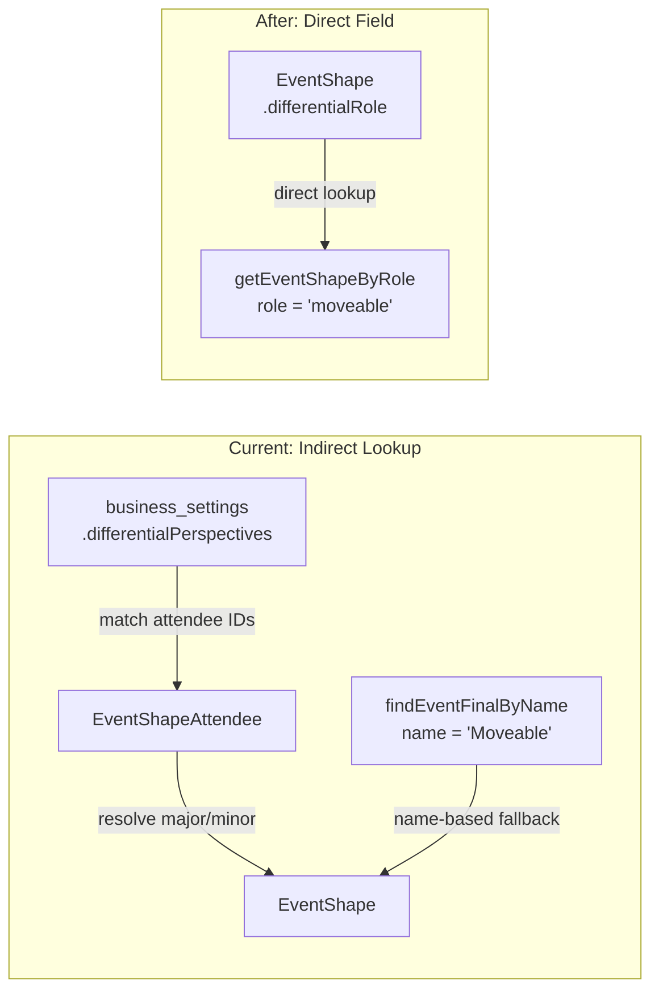

## Phase 3.6

**Status:** In Progress
**Branch:** `calendar-appointment-availability-phase-3.6`

# Add `differentialRole` to EventShape and Re-enable Moveable Modal

## Problem

Two issues addressed together:

1. **Indirect role resolution** -- The system determines an event shape's differential role (major/minor/moveable) through attendee matching and name-based fallbacks instead of a direct field. This is fragile and hard to configure.
2. **Moveable modal disabled** -- The moveable parts scheduling modal is fully built but its trigger is commented out in [client/src/composables/booking/useAvailabilityStepHandlers.ts](client/src/composables/booking/useAvailabilityStepHandlers.ts) at line 90.

## Architecture: Before vs. After




## Part A: `differentialRole` Field (same as existing plan)

### A1. Server migration

New migration file in `server/src/db/migrations/`:

- `ALTER TABLE event_shapes ADD COLUMN differential_role varchar(12) DEFAULT NULL`
- UPDATE existing rows based on current names (Total Time -> major, Client Presentation -> minor, Moveable Part -> moveable)
- Seed `admin_metadata` for `differentialRole` field (render_as: `select`, options: Major/Minor/Moveable/None)

### A2. Server model

[server/src/db/models/booking/event_shape.ts](server/src/db/models/booking/event_shape.ts):

```typescript
declare differentialRole: CreationOptional<'major' | 'minor' | 'moveable' | null>;
```

And in `EventShapeFactory.init()`:

```typescript
differentialRole: {
  type: DataTypes.STRING(12),
  allowNull: true,
  defaultValue: null,
  field: 'differential_role',
}
```

### A3. Client types and configs

- [client/src/types/entities.ts](client/src/types/entities.ts) -- Add `differentialRole: 'major' | 'minor' | 'moveable' | null` to `EventShapeEntity`
- [client/src/configs/field/form/appliedForm/eventShapeFields.ts](client/src/configs/field/form/appliedForm/eventShapeFields.ts) -- Add form field config (select with 4 options)
- [client/src/configs/field/display/appliedDisplay/eventShapeDisplays.ts](client/src/configs/field/display/appliedDisplay/eventShapeDisplays.ts) -- Add display config

### A4. Core resolution utility

[client/src/utils/eventAttendeeUtils.ts](client/src/utils/eventAttendeeUtils.ts) -- Add new function:

```typescript
function getEventShapeByRole(
  eventShapes: EventShapeEntity[],
  role: 'major' | 'minor' | 'moveable'
): EventShapeEntity | null {
  return eventShapes.find(es => es.differentialRole === role) ?? null
}
```

Keep existing `getMajorEventShape`/`getMinorEventShape` but mark deprecated.

### A5. Update 9 consumer files

Each follows the same pattern: use `differentialRole` first, fall back to attendee matching:

- [client/src/utils/booking/perspectiveResolver.ts](client/src/utils/booking/perspectiveResolver.ts) -- `resolveEventShapes()`
- [client/src/utils/differentialScheduling.ts](client/src/utils/differentialScheduling.ts) -- `resolveMajorMinorEventFinals()`
- [client/src/utils/booking/partFinalizer.ts](client/src/utils/booking/partFinalizer.ts) -- differential offset calculation
- [client/src/utils/booking/availabilityStepData.ts](client/src/utils/booking/availabilityStepData.ts) -- selected time slot building
- [client/src/utils/booking/appointmentSlotBuilder.ts](client/src/utils/booking/appointmentSlotBuilder.ts) -- `applyShapeToTime`
- [client/src/composables/booking/useTimeSlotCalculations.ts](client/src/composables/booking/useTimeSlotCalculations.ts) -- major/minor duration
- [client/src/composables/booking/useMoveablePartsScheduling.ts](client/src/composables/booking/useMoveablePartsScheduling.ts) -- moveable detection (detailed below)
- [client/src/composables/booking/useAppointmentSlots.ts](client/src/composables/booking/useAppointmentSlots.ts) -- graph bar building
- [client/src/configs/eventPerspectiveLabels.ts](client/src/configs/eventPerspectiveLabels.ts) -- if it uses attendee-based lookup

## Part B: Re-enable Moveable Modal

### B1. Update detection in `useMoveablePartsScheduling.ts`

[client/src/composables/booking/useMoveablePartsScheduling.ts](client/src/composables/booking/useMoveablePartsScheduling.ts):

Replace the name-based detection:

```typescript
// BEFORE (line 136-142):
const hasMoveableParts = computed(() => {
  const shape = appointmentShape.value
  if (!shape) return false
  const moveableEventFinal = findEventFinalByName(shape.slotShape, 'Moveable')
  return (moveableEventFinal?.roundedDuration ?? 0) > 0
})
```

With role-based detection:

```typescript
// AFTER:
const hasMoveableParts = computed(() => {
  const shape = appointmentShape.value
  if (!shape) return false
  const moveableEventFinal = shape.slotShape.eventFinals
    .find(ef => ef.eventShape.differentialRole === 'moveable')
  return (moveableEventFinal?.roundedDuration ?? 0) > 0
})
```

Same change for `moveableDuration` (lines 144-149).

Also update the major time range lookup (lines 161-174) from attendee-based `getMajorEventShape()` to `getEventShapeByRole(entities, 'major')`.

### B2. Re-enable the trigger

[client/src/composables/booking/useAvailabilityStepHandlers.ts](client/src/composables/booking/useAvailabilityStepHandlers.ts) line 87-91:

```typescript
// BEFORE:
const handleAppointmentSlotClick = (buttonIndex: number): void => {
  appointmentSlotOrderIndex.value = buttonIndex
  // TEMPORARY: Moveable parts scheduling disabled
}

// AFTER:
const handleAppointmentSlotClick = (buttonIndex: number): void => {
  appointmentSlotOrderIndex.value = buttonIndex
  if (hasMoveableParts.value) {
    openMoveableModal()
  }
}
```

### B3. What already works (no changes needed)

These are fully implemented and just need the trigger:

- `MoveablePartsModal.vue` -- Full UI with contingency questions, slot selection, confirm/cancel
- `minimalSlotGenerator.ts` -- Generates time slots in range (pure function, tested pattern)
- `confirmedMoveableScheduling` ref in `useAvailabilityOrchestrator.ts` -- Flows into `useAvailabilityStepData` which includes it in step data
- `handleMoveableConfirm` / `handleMoveableCancel` -- Both fully implemented

## What Stays the Same

- `differentialPerspectives.majorAttendees` / `minorAttendees` in business settings -- still used for attendee quick-select buttons and labels
- `EventShapeAttendee` relationship -- still used for calendar invite attendee determination
- `isTernary` / `ternaryDefault` fields -- unchanged, orthogonal concept
- Server-side availability computation -- does not use major/minor concepts
- `MoveablePartsModal.vue` -- No changes needed to the component itself

## Sessions

- [x] ### Session 3.6.1: Type maintenance and remaining audit fixes
- [x] ### Session 3.6.2: differentialRole field and moveable modal re-enablement

