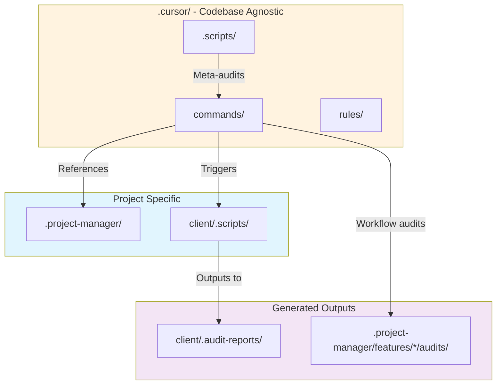

# Development Tools & Project Structure

**Last Updated:** 2026-01-09

This document explains the organization of development tools, scripts, and project management documentation in this repository.

---

## Directory Structure Philosophy

The project distinguishes between:
- **Codebase-agnostic tools** (in `.cursor/`) - Reusable across projects
- **Project-specific tools** (at root level) - Specific to this codebase
- **Application code** (in `client/`, `server/`) - The actual application

**Hidden directories** (`.prefix`) indicate tooling/generated content, not application code.

---

## Directory Organization

```
Differential_Scheduler/
├── .cursor/                    # Codebase-agnostic development environment
│   ├── commands/              # Slash commands (workflow automation)
│   ├── rules/                 # Coding standards and guidelines
│   ├── .scripts/              # Generic audit utilities
│   └── README.md
│
├── .project-manager/          # Project-specific planning (this project)
│   ├── features/              # Feature documentation
│   ├── PROJECT_PLAN.md        # Master plan
│   └── README.md
│
├── client/                    # Vue.js client application
│   ├── .scripts/              # Client-specific code quality tools
│   ├── .audit-reports/        # Generated audit reports (output)
│   └── src/                   # Application code
│
└── server/                    # Node.js server application
    └── src/                   # Application code
```

---

## Tool Categories

### 1. Cursor Commands (`.cursor/commands/`)

**Purpose:** Slash commands for AI-assisted workflow automation

**Type:** Codebase-agnostic (reusable across projects)

**Categories:**
- **Tier commands** - Feature/Phase/Session/Task workflow management
- **Audit commands** - Workflow quality checks (comments, planning, todos, security, etc.)
- **Git commands** - Git operations (commit, push, branch, merge)
- **Planning commands** - Planning with documentation checks
- **Testing commands** - Test execution and validation
- **Document commands** - Document operations (read, list, extract sections)
- **Handoff commands** - Generate and review handoff documents

**Usage:**
- Via Cursor slash commands: `/session-start`, `/phase-end`, etc.
- Programmatic: `import { sessionStart } from '.cursor/commands'`

**Integration:** Commands reference `.project-manager/` for project-specific docs

---

### 2. Generic Audit Utilities (`.cursor/.scripts/`)

**Purpose:** Meta-audits of the Cursor command system itself

**Type:** Codebase-agnostic

**Scripts:**
- `refactor-audit.mjs` - Detects plan/execute mismatches, path issues in commands
- `refactor-audit-summary.mjs` - Summary generator
- `_audit-utils.mjs` - Shared utilities for audit scripts

**Output:** `.cursor/.audit/` (if created)

**When to run:** When modifying `.cursor/commands/` structure

---

### 3. Client Code Quality Tools (`client/.scripts/`)

**Purpose:** Scan client codebase for code quality issues

**Type:** Project-specific (Vue client codebase)

**Scripts:**

#### Audit Generators:
- `duplication-audit.mjs` - Finds repeated code (DRY opportunities)
- `hardcoding-audit.mjs` - Detects hardcoded entity keys
- `loop-mutation-audit.mjs` - Finds forEach mutations (prefer functional patterns)
- `component-logic-audit.mjs` - Analyzes component logic complexity
- `composables-logic-audit.mjs` - Analyzes composable logic complexity
- `test-audit.mjs` - Identifies untested code and orphaned tests

#### Typecheck Tools:
- `typecheck-audit.mjs` - TypeScript error detection with prioritization
- `typecheck-run.mjs` - Runs vue-tsc and generates reports
- `typecheck-audit-summary.mjs` - Summary generator

#### Summary Generators:
- `*-audit-summary.mjs` - Generate summaries for each audit type

#### Test Utilities:
- `test-cleanup.mjs` - Clean up test files
- `test-generate-api.mjs` - Generate test templates (if used)
- `test-generate-for-ai.mjs` - AI-friendly test generation (if used)
- `test-logic-generator.mjs` - Test logic generation (if used)

#### Shared:
- `audit-exceptions.mjs` - Exception handling for audit scripts

**Output:** `client/.audit-reports/`

**When to run:**
- **Automatically:** At `/session-end` and `/phase-end` (integrated into workflow)
- **Manually:** Before commits: `npm run audit:all`
- **Individual audits:** During refactoring
- **Weekly reviews:** Full audit suite

**NPM Scripts (from `client/package.json`):**
```bash
npm run typecheck:audit        # Run typecheck audit
npm run audit:duplication      # Run duplication audit
npm run audit:hardcoding       # Run hardcoding audit
npm run audit:loop-mutations   # Run loop mutation audit
npm run audit:test             # Run test coverage audit
npm run audit:all              # Run all audits + summaries
```

---

### 4. Audit Reports (`client/.audit-reports/`)

**Purpose:** Generated reports from code quality audits

**Type:** Output directory (generated, not source code)

**Structure:**
```
client/.audit-reports/
├── typecheck/                     # TypeScript error reports
│   ├── typecheck-audit.json
│   ├── typecheck-audit.md
│   ├── typecheck-audit-summary.md
│   └── typecheck-audit-config.json
│
├── duplication-audit.json         # DRY opportunities
├── duplication-audit.md
├── hardcoding-audit.json          # Hardcoded values
├── hardcoding-audit.md
├── loop-mutation-audit.json       # forEach mutations
├── loop-mutation-audit.md
├── test-audit.json                # Test coverage gaps
├── test-audit.md
└── AUDIT_STATUS.md                # Overall status summary
```

**Usage:**
- Review reports before committing
- Track quality improvements over time
- Prioritize refactoring work (P0/P1/P2)

**Configuration:**
- `*-audit-config.json` - Configure weights, priorities, exclusions
- `AUDIT_EXCLUSIONS.md` - Document audit exclusions and exceptions

---

### 5. Project Planning (`.project-manager/`)

**Purpose:** Project-specific planning and documentation

**Type:** Project-specific

**Structure:**
```
.project-manager/
├── PROJECT_PLAN.md                # Master plan (single source of truth)
├── MASTER_FEATURE_INDEX.md       # Feature overview
├── FEATURE_VALIDATION_CHECKLIST.md
├── features/                      # Feature-specific docs
│   ├── vue-migration/
│   │   ├── phases/               # Phase guides
│   │   ├── sessions/             # Session logs
│   │   └── audits/               # Workflow audits
│   ├── data-flow-alignment/
│   ├── ui-polish/
│   └── ...
└── archive/                       # Historical documents
```

**Usage:**
- Cursor slash commands reference this for project context
- Source of truth for current work and planning
- Maintains historical session/phase logs

**Integration:**
- `.cursor/commands/` reads from `.project-manager/`
- Workflow audits output to `.project-manager/features/{feature}/audits/`

---

## GitHub PR Workflow Integration

### Automated PR Creation (Session-End)

**Purpose:** Automatically create pull requests at the end of each session

**How it works:**
1. At `/session-end`, after git operations complete
2. Checks if GitHub CLI is authenticated
3. Creates PR with session title and description
4. Assigns PR to you automatically
5. Provides PR link for review assignment

**Requirements:**
- GitHub CLI (`gh`) installed and authenticated ✅ (v2.63.2)
- Not on `main`/`master` branch
- Git operations not skipped

**Manual PR Creation:**
```bash
# If automated creation fails:
node .cursor/.scripts/create-pr.mjs "Session X.Y: Title" "Description"

# Or use gh CLI directly:
gh pr create --title "Title" --body "Description" --assignee @me
```

### GitHub Validation Checkpoints

**Phase-End Validation:**
After completing a phase, you'll receive a prompt to verify on GitHub:
- All session PRs from the phase are merged
- No outstanding review comments
- Phase branch is clean and ready

**Feature-End Validation:**
After completing a feature, you'll receive a prompt to verify on GitHub:
- All phase PRs merged to main
- Feature branch fully integrated
- All reviews complete
- CI/CD checks passing

### PR Workflow Best Practices

```
Task-end:     No PR (too granular)
             
Session-end:  ✅ Create PR automatically
             (Cohesive, reviewable chunk)
             
Phase-end:    ✅ Validate all PRs merged
             (Checkpoint before phase close)
             
Feature-end:  ✅ Final validation
             (Ensure everything in main)
```

---

## Tool Integration Flow



---

## When to Use Which Tool

### Before Starting Work
1. Check `.project-manager/PROJECT_PLAN.md` for current priorities
2. Use Cursor commands: `/session-start`, `/phase-start`

### During Development
1. Run `npm run typecheck:audit` to catch type errors early
2. Use linting: `npm run lint`
3. Run tests: `npm run test:watch`

### Before Committing
1. Run `npm run audit:all` to catch quality issues
2. Review reports in `client/.audit-reports/`
3. Fix P0/P1 issues
4. Use Cursor commands: `/session-end`, `/task-end`

### Code Review
1. Review audit reports
2. Check workflow audit outputs in `.project-manager/features/*/audits/`
3. Verify documentation updated

### When Modifying Cursor Commands
1. Run `.cursor/.scripts/refactor-audit.mjs`
2. Check for path issues and plan/execute mismatches

---

## Quick Reference

| Task | Command | Location |
|------|---------|----------|
| Run all audits | `cd client && npm run audit:all` | `client/.scripts/` |
| Typecheck | `cd client && npm run typecheck:audit` | `client/.scripts/` |
| Start session | Use `/session-start` in Cursor | `.cursor/commands/` |
| View project plan | Open `.project-manager/PROJECT_PLAN.md` | `.project-manager/` |
| Audit Cursor commands | `node .cursor/.scripts/refactor-audit.mjs` | `.cursor/.scripts/` |

---

## Configuration Files

### Audit Configuration
- `client/.audit-reports/*-audit-config.json` - Audit weights, priorities, exclusions
- `client/.audit-reports/AUDIT_EXCLUSIONS.md` - Documentation of exclusions

### Project Configuration
- `client/package.json` - NPM scripts for audits
- `.cursor/rules/` - Coding standards
- `.project-manager/PROJECT_PLAN.md` - Project roadmap

---

## Historical Note

**Migration (2026-01-09):** Consolidated project structure:
- Moved `project-manager/` → `.project-manager/` (project-specific)
- Moved `client/scripts/` → `client/.scripts/` (hidden tooling)
- Moved `.cursor/scripts/` → `.cursor/.scripts/` (hidden tooling)
- Merged `client/.audit/` + `client/.typecheck/` → `client/.audit-reports/`
- Deleted obsolete `.cursor/project-manager/` (duplicate)
- Deleted root `scripts/` (one-time migrations)

**Rationale:** Clear separation between codebase-agnostic tools (`.cursor/`), project-specific planning (`.project-manager/`), and application code (`client/src/`, `server/src/`).

---

## Questions?

- **Cursor commands:** See `.cursor/README.md`
- **Project planning:** See `.project-manager/README.md`
- **Audit configuration:** See `client/.audit-reports/AUDIT_EXCLUSIONS.md`
- **Coding standards:** See `.cursor/rules/PROJECT_CODING_RULES.md`
